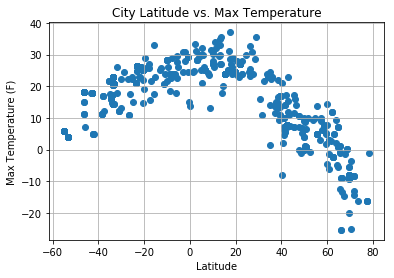
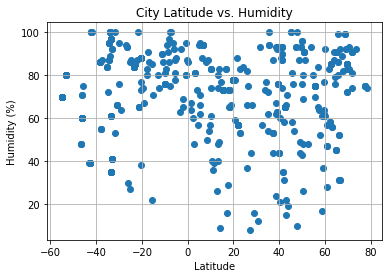
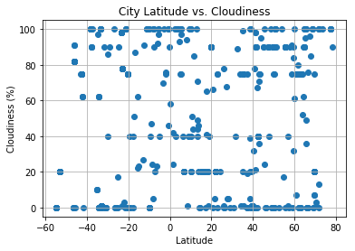
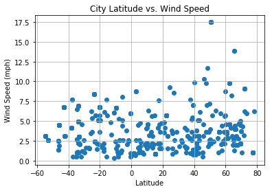

# python_api


```python
# Dependencies
import matplotlib.pyplot as plt
import requests as requests
import pandas as pd
import seaborn as sb
import numpy as np
import csv
import json
from citipy import citipy
```


```python
api_key = "846827e0490ffa1fcbd3d1a2deb0250b"
url = "http://api.openweathermap.org/data/2.5/weather?units=metric&APPID=" + api_key
```


```python
#Extracting response for 500 cities
cities = [] 
city_weather_data = []
lats = np.random.randint(low = -90, high = 90, size = 1000)
lons = np.random.randint(low = -180, high = 180, size = 1000)
for lat, lon in zip(lats, lons):
    
    city = citipy.nearest_city(lat, lon)
    
    city_weather_request_url = url + "&q=" + city.city_name
    print("City: " + city.city_name + "; url: " + city_weather_request_url)
    
    response = requests.get(city_weather_request_url)
    
    if response.status_code != 404:
        city_weather_data.append(response.json())
        
    elif response.status_code == 500:
        print(response.status_code + ": " + city_weather_request_url)


```

    City: gazanjyk; url: http://api.openweathermap.org/data/2.5/weather?units=metric&APPID=846827e0490ffa1fcbd3d1a2deb0250b&q=gazanjyk
    City: smithers; url: http://api.openweathermap.org/data/2.5/weather?units=metric&APPID=846827e0490ffa1fcbd3d1a2deb0250b&q=smithers
    City: orlik; url: http://api.openweathermap.org/data/2.5/weather?units=metric&APPID=846827e0490ffa1fcbd3d1a2deb0250b&q=orlik
    City: homer; url: http://api.openweathermap.org/data/2.5/weather?units=metric&APPID=846827e0490ffa1fcbd3d1a2deb0250b&q=homer
    City: faanui; url: http://api.openweathermap.org/data/2.5/weather?units=metric&APPID=846827e0490ffa1fcbd3d1a2deb0250b&q=faanui
    City: hermanus; url: http://api.openweathermap.org/data/2.5/weather?units=metric&APPID=846827e0490ffa1fcbd3d1a2deb0250b&q=hermanus
    City: kapaa; url: http://api.openweathermap.org/data/2.5/weather?units=metric&APPID=846827e0490ffa1fcbd3d1a2deb0250b&q=kapaa
    City: khatanga; url: http://api.openweathermap.org/data/2.5/weather?units=metric&APPID=846827e0490ffa1fcbd3d1a2deb0250b&q=khatanga
    City: marrakesh; url: http://api.openweathermap.org/data/2.5/weather?units=metric&APPID=846827e0490ffa1fcbd3d1a2deb0250b&q=marrakesh
    City: east london; url: http://api.openweathermap.org/data/2.5/weather?units=metric&APPID=846827e0490ffa1fcbd3d1a2deb0250b&q=east london
    City: udachnyy; url: http://api.openweathermap.org/data/2.5/weather?units=metric&APPID=846827e0490ffa1fcbd3d1a2deb0250b&q=udachnyy
    City: jamestown; url: http://api.openweathermap.org/data/2.5/weather?units=metric&APPID=846827e0490ffa1fcbd3d1a2deb0250b&q=jamestown
    City: victoria; url: http://api.openweathermap.org/data/2.5/weather?units=metric&APPID=846827e0490ffa1fcbd3d1a2deb0250b&q=victoria
    City: gat; url: http://api.openweathermap.org/data/2.5/weather?units=metric&APPID=846827e0490ffa1fcbd3d1a2deb0250b&q=gat
    City: tuktoyaktuk; url: http://api.openweathermap.org/data/2.5/weather?units=metric&APPID=846827e0490ffa1fcbd3d1a2deb0250b&q=tuktoyaktuk
    City: banda aceh; url: http://api.openweathermap.org/data/2.5/weather?units=metric&APPID=846827e0490ffa1fcbd3d1a2deb0250b&q=banda aceh
    City: kotka; url: http://api.openweathermap.org/data/2.5/weather?units=metric&APPID=846827e0490ffa1fcbd3d1a2deb0250b&q=kotka
    City: mount gambier; url: http://api.openweathermap.org/data/2.5/weather?units=metric&APPID=846827e0490ffa1fcbd3d1a2deb0250b&q=mount gambier
    City: busselton; url: http://api.openweathermap.org/data/2.5/weather?units=metric&APPID=846827e0490ffa1fcbd3d1a2deb0250b&q=busselton
    City: rikitea; url: http://api.openweathermap.org/data/2.5/weather?units=metric&APPID=846827e0490ffa1fcbd3d1a2deb0250b&q=rikitea
    City: oktyabrskiy; url: http://api.openweathermap.org/data/2.5/weather?units=metric&APPID=846827e0490ffa1fcbd3d1a2deb0250b&q=oktyabrskiy
    City: mar del plata; url: http://api.openweathermap.org/data/2.5/weather?units=metric&APPID=846827e0490ffa1fcbd3d1a2deb0250b&q=mar del plata
    City: vaini; url: http://api.openweathermap.org/data/2.5/weather?units=metric&APPID=846827e0490ffa1fcbd3d1a2deb0250b&q=vaini
    City: port alfred; url: http://api.openweathermap.org/data/2.5/weather?units=metric&APPID=846827e0490ffa1fcbd3d1a2deb0250b&q=port alfred
    City: saint-philippe; url: http://api.openweathermap.org/data/2.5/weather?units=metric&APPID=846827e0490ffa1fcbd3d1a2deb0250b&q=saint-philippe
    City: skalistyy; url: http://api.openweathermap.org/data/2.5/weather?units=metric&APPID=846827e0490ffa1fcbd3d1a2deb0250b&q=skalistyy
    City: jamestown; url: http://api.openweathermap.org/data/2.5/weather?units=metric&APPID=846827e0490ffa1fcbd3d1a2deb0250b&q=jamestown
    City: angoche; url: http://api.openweathermap.org/data/2.5/weather?units=metric&APPID=846827e0490ffa1fcbd3d1a2deb0250b&q=angoche
    City: chandur; url: http://api.openweathermap.org/data/2.5/weather?units=metric&APPID=846827e0490ffa1fcbd3d1a2deb0250b&q=chandur
    City: chuy; url: http://api.openweathermap.org/data/2.5/weather?units=metric&APPID=846827e0490ffa1fcbd3d1a2deb0250b&q=chuy
    City: vostok; url: http://api.openweathermap.org/data/2.5/weather?units=metric&APPID=846827e0490ffa1fcbd3d1a2deb0250b&q=vostok
    City: punta arenas; url: http://api.openweathermap.org/data/2.5/weather?units=metric&APPID=846827e0490ffa1fcbd3d1a2deb0250b&q=punta arenas
    City: kapaa; url: http://api.openweathermap.org/data/2.5/weather?units=metric&APPID=846827e0490ffa1fcbd3d1a2deb0250b&q=kapaa
    City: gunjur; url: http://api.openweathermap.org/data/2.5/weather?units=metric&APPID=846827e0490ffa1fcbd3d1a2deb0250b&q=gunjur
    City: busselton; url: http://api.openweathermap.org/data/2.5/weather?units=metric&APPID=846827e0490ffa1fcbd3d1a2deb0250b&q=busselton
    City: matamba; url: http://api.openweathermap.org/data/2.5/weather?units=metric&APPID=846827e0490ffa1fcbd3d1a2deb0250b&q=matamba
    City: kozhva; url: http://api.openweathermap.org/data/2.5/weather?units=metric&APPID=846827e0490ffa1fcbd3d1a2deb0250b&q=kozhva
    City: sabzevar; url: http://api.openweathermap.org/data/2.5/weather?units=metric&APPID=846827e0490ffa1fcbd3d1a2deb0250b&q=sabzevar
    City: libano; url: http://api.openweathermap.org/data/2.5/weather?units=metric&APPID=846827e0490ffa1fcbd3d1a2deb0250b&q=libano
    City: praia; url: http://api.openweathermap.org/data/2.5/weather?units=metric&APPID=846827e0490ffa1fcbd3d1a2deb0250b&q=praia
    City: maceio; url: http://api.openweathermap.org/data/2.5/weather?units=metric&APPID=846827e0490ffa1fcbd3d1a2deb0250b&q=maceio
    City: leshukonskoye; url: http://api.openweathermap.org/data/2.5/weather?units=metric&APPID=846827e0490ffa1fcbd3d1a2deb0250b&q=leshukonskoye
    City: salalah; url: http://api.openweathermap.org/data/2.5/weather?units=metric&APPID=846827e0490ffa1fcbd3d1a2deb0250b&q=salalah
    City: bela vista; url: http://api.openweathermap.org/data/2.5/weather?units=metric&APPID=846827e0490ffa1fcbd3d1a2deb0250b&q=bela vista
    City: korla; url: http://api.openweathermap.org/data/2.5/weather?units=metric&APPID=846827e0490ffa1fcbd3d1a2deb0250b&q=korla
    City: caravelas; url: http://api.openweathermap.org/data/2.5/weather?units=metric&APPID=846827e0490ffa1fcbd3d1a2deb0250b&q=caravelas
    City: onguday; url: http://api.openweathermap.org/data/2.5/weather?units=metric&APPID=846827e0490ffa1fcbd3d1a2deb0250b&q=onguday
    City: puerto suarez; url: http://api.openweathermap.org/data/2.5/weather?units=metric&APPID=846827e0490ffa1fcbd3d1a2deb0250b&q=puerto suarez
    City: daru; url: http://api.openweathermap.org/data/2.5/weather?units=metric&APPID=846827e0490ffa1fcbd3d1a2deb0250b&q=daru
    City: bolshoye sorokino; url: http://api.openweathermap.org/data/2.5/weather?units=metric&APPID=846827e0490ffa1fcbd3d1a2deb0250b&q=bolshoye sorokino
    City: hualmay; url: http://api.openweathermap.org/data/2.5/weather?units=metric&APPID=846827e0490ffa1fcbd3d1a2deb0250b&q=hualmay
    City: ostersund; url: http://api.openweathermap.org/data/2.5/weather?units=metric&APPID=846827e0490ffa1fcbd3d1a2deb0250b&q=ostersund
    City: panguna; url: http://api.openweathermap.org/data/2.5/weather?units=metric&APPID=846827e0490ffa1fcbd3d1a2deb0250b&q=panguna
    City: fort morgan; url: http://api.openweathermap.org/data/2.5/weather?units=metric&APPID=846827e0490ffa1fcbd3d1a2deb0250b&q=fort morgan
    City: mildura; url: http://api.openweathermap.org/data/2.5/weather?units=metric&APPID=846827e0490ffa1fcbd3d1a2deb0250b&q=mildura
    City: punta arenas; url: http://api.openweathermap.org/data/2.5/weather?units=metric&APPID=846827e0490ffa1fcbd3d1a2deb0250b&q=punta arenas
    City: bambanglipuro; url: http://api.openweathermap.org/data/2.5/weather?units=metric&APPID=846827e0490ffa1fcbd3d1a2deb0250b&q=bambanglipuro
    City: new norfolk; url: http://api.openweathermap.org/data/2.5/weather?units=metric&APPID=846827e0490ffa1fcbd3d1a2deb0250b&q=new norfolk
    City: mahebourg; url: http://api.openweathermap.org/data/2.5/weather?units=metric&APPID=846827e0490ffa1fcbd3d1a2deb0250b&q=mahebourg
    City: pevek; url: http://api.openweathermap.org/data/2.5/weather?units=metric&APPID=846827e0490ffa1fcbd3d1a2deb0250b&q=pevek
    City: ionia; url: http://api.openweathermap.org/data/2.5/weather?units=metric&APPID=846827e0490ffa1fcbd3d1a2deb0250b&q=ionia
    City: port elizabeth; url: http://api.openweathermap.org/data/2.5/weather?units=metric&APPID=846827e0490ffa1fcbd3d1a2deb0250b&q=port elizabeth
    City: carnarvon; url: http://api.openweathermap.org/data/2.5/weather?units=metric&APPID=846827e0490ffa1fcbd3d1a2deb0250b&q=carnarvon
    City: ribeira grande; url: http://api.openweathermap.org/data/2.5/weather?units=metric&APPID=846827e0490ffa1fcbd3d1a2deb0250b&q=ribeira grande
    City: canutama; url: http://api.openweathermap.org/data/2.5/weather?units=metric&APPID=846827e0490ffa1fcbd3d1a2deb0250b&q=canutama
    City: punta arenas; url: http://api.openweathermap.org/data/2.5/weather?units=metric&APPID=846827e0490ffa1fcbd3d1a2deb0250b&q=punta arenas
    City: port blair; url: http://api.openweathermap.org/data/2.5/weather?units=metric&APPID=846827e0490ffa1fcbd3d1a2deb0250b&q=port blair
    City: bluff; url: http://api.openweathermap.org/data/2.5/weather?units=metric&APPID=846827e0490ffa1fcbd3d1a2deb0250b&q=bluff
    City: jamestown; url: http://api.openweathermap.org/data/2.5/weather?units=metric&APPID=846827e0490ffa1fcbd3d1a2deb0250b&q=jamestown
    City: puerto ayora; url: http://api.openweathermap.org/data/2.5/weather?units=metric&APPID=846827e0490ffa1fcbd3d1a2deb0250b&q=puerto ayora
    City: aksu; url: http://api.openweathermap.org/data/2.5/weather?units=metric&APPID=846827e0490ffa1fcbd3d1a2deb0250b&q=aksu
    City: atuona; url: http://api.openweathermap.org/data/2.5/weather?units=metric&APPID=846827e0490ffa1fcbd3d1a2deb0250b&q=atuona
    City: hithadhoo; url: http://api.openweathermap.org/data/2.5/weather?units=metric&APPID=846827e0490ffa1fcbd3d1a2deb0250b&q=hithadhoo
    City: tailai; url: http://api.openweathermap.org/data/2.5/weather?units=metric&APPID=846827e0490ffa1fcbd3d1a2deb0250b&q=tailai
    City: cherskiy; url: http://api.openweathermap.org/data/2.5/weather?units=metric&APPID=846827e0490ffa1fcbd3d1a2deb0250b&q=cherskiy
    City: ushuaia; url: http://api.openweathermap.org/data/2.5/weather?units=metric&APPID=846827e0490ffa1fcbd3d1a2deb0250b&q=ushuaia
    City: panvel; url: http://api.openweathermap.org/data/2.5/weather?units=metric&APPID=846827e0490ffa1fcbd3d1a2deb0250b&q=panvel
    City: esperance; url: http://api.openweathermap.org/data/2.5/weather?units=metric&APPID=846827e0490ffa1fcbd3d1a2deb0250b&q=esperance
    City: tandil; url: http://api.openweathermap.org/data/2.5/weather?units=metric&APPID=846827e0490ffa1fcbd3d1a2deb0250b&q=tandil
    City: hermanus; url: http://api.openweathermap.org/data/2.5/weather?units=metric&APPID=846827e0490ffa1fcbd3d1a2deb0250b&q=hermanus
    City: vaini; url: http://api.openweathermap.org/data/2.5/weather?units=metric&APPID=846827e0490ffa1fcbd3d1a2deb0250b&q=vaini
    City: hobart; url: http://api.openweathermap.org/data/2.5/weather?units=metric&APPID=846827e0490ffa1fcbd3d1a2deb0250b&q=hobart
    City: albany; url: http://api.openweathermap.org/data/2.5/weather?units=metric&APPID=846827e0490ffa1fcbd3d1a2deb0250b&q=albany
    City: rikitea; url: http://api.openweathermap.org/data/2.5/weather?units=metric&APPID=846827e0490ffa1fcbd3d1a2deb0250b&q=rikitea
    City: tsihombe; url: http://api.openweathermap.org/data/2.5/weather?units=metric&APPID=846827e0490ffa1fcbd3d1a2deb0250b&q=tsihombe
    City: taolanaro; url: http://api.openweathermap.org/data/2.5/weather?units=metric&APPID=846827e0490ffa1fcbd3d1a2deb0250b&q=taolanaro
    City: tuktoyaktuk; url: http://api.openweathermap.org/data/2.5/weather?units=metric&APPID=846827e0490ffa1fcbd3d1a2deb0250b&q=tuktoyaktuk
    City: ust-nera; url: http://api.openweathermap.org/data/2.5/weather?units=metric&APPID=846827e0490ffa1fcbd3d1a2deb0250b&q=ust-nera
    City: port alfred; url: http://api.openweathermap.org/data/2.5/weather?units=metric&APPID=846827e0490ffa1fcbd3d1a2deb0250b&q=port alfred
    City: busselton; url: http://api.openweathermap.org/data/2.5/weather?units=metric&APPID=846827e0490ffa1fcbd3d1a2deb0250b&q=busselton
    City: punta arenas; url: http://api.openweathermap.org/data/2.5/weather?units=metric&APPID=846827e0490ffa1fcbd3d1a2deb0250b&q=punta arenas
    City: bluff; url: http://api.openweathermap.org/data/2.5/weather?units=metric&APPID=846827e0490ffa1fcbd3d1a2deb0250b&q=bluff
    City: misratah; url: http://api.openweathermap.org/data/2.5/weather?units=metric&APPID=846827e0490ffa1fcbd3d1a2deb0250b&q=misratah
    City: yellowknife; url: http://api.openweathermap.org/data/2.5/weather?units=metric&APPID=846827e0490ffa1fcbd3d1a2deb0250b&q=yellowknife
    City: provideniya; url: http://api.openweathermap.org/data/2.5/weather?units=metric&APPID=846827e0490ffa1fcbd3d1a2deb0250b&q=provideniya
    City: pitimbu; url: http://api.openweathermap.org/data/2.5/weather?units=metric&APPID=846827e0490ffa1fcbd3d1a2deb0250b&q=pitimbu
    City: kodinsk; url: http://api.openweathermap.org/data/2.5/weather?units=metric&APPID=846827e0490ffa1fcbd3d1a2deb0250b&q=kodinsk
    City: mataura; url: http://api.openweathermap.org/data/2.5/weather?units=metric&APPID=846827e0490ffa1fcbd3d1a2deb0250b&q=mataura
    City: tuktoyaktuk; url: http://api.openweathermap.org/data/2.5/weather?units=metric&APPID=846827e0490ffa1fcbd3d1a2deb0250b&q=tuktoyaktuk
    City: mataura; url: http://api.openweathermap.org/data/2.5/weather?units=metric&APPID=846827e0490ffa1fcbd3d1a2deb0250b&q=mataura
    City: bredasdorp; url: http://api.openweathermap.org/data/2.5/weather?units=metric&APPID=846827e0490ffa1fcbd3d1a2deb0250b&q=bredasdorp
    City: taolanaro; url: http://api.openweathermap.org/data/2.5/weather?units=metric&APPID=846827e0490ffa1fcbd3d1a2deb0250b&q=taolanaro
    City: palabuhanratu; url: http://api.openweathermap.org/data/2.5/weather?units=metric&APPID=846827e0490ffa1fcbd3d1a2deb0250b&q=palabuhanratu
    City: tamale; url: http://api.openweathermap.org/data/2.5/weather?units=metric&APPID=846827e0490ffa1fcbd3d1a2deb0250b&q=tamale
    City: geresk; url: http://api.openweathermap.org/data/2.5/weather?units=metric&APPID=846827e0490ffa1fcbd3d1a2deb0250b&q=geresk
    City: arraial do cabo; url: http://api.openweathermap.org/data/2.5/weather?units=metric&APPID=846827e0490ffa1fcbd3d1a2deb0250b&q=arraial do cabo
    City: santa cruz del sur; url: http://api.openweathermap.org/data/2.5/weather?units=metric&APPID=846827e0490ffa1fcbd3d1a2deb0250b&q=santa cruz del sur
    City: san cristobal; url: http://api.openweathermap.org/data/2.5/weather?units=metric&APPID=846827e0490ffa1fcbd3d1a2deb0250b&q=san cristobal
    City: mataura; url: http://api.openweathermap.org/data/2.5/weather?units=metric&APPID=846827e0490ffa1fcbd3d1a2deb0250b&q=mataura
    City: sao filipe; url: http://api.openweathermap.org/data/2.5/weather?units=metric&APPID=846827e0490ffa1fcbd3d1a2deb0250b&q=sao filipe
    City: acapulco; url: http://api.openweathermap.org/data/2.5/weather?units=metric&APPID=846827e0490ffa1fcbd3d1a2deb0250b&q=acapulco
    City: inhambane; url: http://api.openweathermap.org/data/2.5/weather?units=metric&APPID=846827e0490ffa1fcbd3d1a2deb0250b&q=inhambane
    City: ust-tsilma; url: http://api.openweathermap.org/data/2.5/weather?units=metric&APPID=846827e0490ffa1fcbd3d1a2deb0250b&q=ust-tsilma
    City: olafsvik; url: http://api.openweathermap.org/data/2.5/weather?units=metric&APPID=846827e0490ffa1fcbd3d1a2deb0250b&q=olafsvik
    City: stornoway; url: http://api.openweathermap.org/data/2.5/weather?units=metric&APPID=846827e0490ffa1fcbd3d1a2deb0250b&q=stornoway
    City: naftah; url: http://api.openweathermap.org/data/2.5/weather?units=metric&APPID=846827e0490ffa1fcbd3d1a2deb0250b&q=naftah
    City: east london; url: http://api.openweathermap.org/data/2.5/weather?units=metric&APPID=846827e0490ffa1fcbd3d1a2deb0250b&q=east london
    City: toliary; url: http://api.openweathermap.org/data/2.5/weather?units=metric&APPID=846827e0490ffa1fcbd3d1a2deb0250b&q=toliary
    City: torbay; url: http://api.openweathermap.org/data/2.5/weather?units=metric&APPID=846827e0490ffa1fcbd3d1a2deb0250b&q=torbay
    City: taolanaro; url: http://api.openweathermap.org/data/2.5/weather?units=metric&APPID=846827e0490ffa1fcbd3d1a2deb0250b&q=taolanaro
    City: butaritari; url: http://api.openweathermap.org/data/2.5/weather?units=metric&APPID=846827e0490ffa1fcbd3d1a2deb0250b&q=butaritari
    City: busselton; url: http://api.openweathermap.org/data/2.5/weather?units=metric&APPID=846827e0490ffa1fcbd3d1a2deb0250b&q=busselton
    City: dikson; url: http://api.openweathermap.org/data/2.5/weather?units=metric&APPID=846827e0490ffa1fcbd3d1a2deb0250b&q=dikson
    City: neokhorion; url: http://api.openweathermap.org/data/2.5/weather?units=metric&APPID=846827e0490ffa1fcbd3d1a2deb0250b&q=neokhorion
    City: kununurra; url: http://api.openweathermap.org/data/2.5/weather?units=metric&APPID=846827e0490ffa1fcbd3d1a2deb0250b&q=kununurra
    City: puerto ayora; url: http://api.openweathermap.org/data/2.5/weather?units=metric&APPID=846827e0490ffa1fcbd3d1a2deb0250b&q=puerto ayora
    City: sorvag; url: http://api.openweathermap.org/data/2.5/weather?units=metric&APPID=846827e0490ffa1fcbd3d1a2deb0250b&q=sorvag
    City: dikson; url: http://api.openweathermap.org/data/2.5/weather?units=metric&APPID=846827e0490ffa1fcbd3d1a2deb0250b&q=dikson
    City: saleaula; url: http://api.openweathermap.org/data/2.5/weather?units=metric&APPID=846827e0490ffa1fcbd3d1a2deb0250b&q=saleaula
    City: ilulissat; url: http://api.openweathermap.org/data/2.5/weather?units=metric&APPID=846827e0490ffa1fcbd3d1a2deb0250b&q=ilulissat
    City: sarangani; url: http://api.openweathermap.org/data/2.5/weather?units=metric&APPID=846827e0490ffa1fcbd3d1a2deb0250b&q=sarangani
    City: georgetown; url: http://api.openweathermap.org/data/2.5/weather?units=metric&APPID=846827e0490ffa1fcbd3d1a2deb0250b&q=georgetown
    City: bluff; url: http://api.openweathermap.org/data/2.5/weather?units=metric&APPID=846827e0490ffa1fcbd3d1a2deb0250b&q=bluff
    City: saint george; url: http://api.openweathermap.org/data/2.5/weather?units=metric&APPID=846827e0490ffa1fcbd3d1a2deb0250b&q=saint george
    City: atuona; url: http://api.openweathermap.org/data/2.5/weather?units=metric&APPID=846827e0490ffa1fcbd3d1a2deb0250b&q=atuona
    City: ahipara; url: http://api.openweathermap.org/data/2.5/weather?units=metric&APPID=846827e0490ffa1fcbd3d1a2deb0250b&q=ahipara
    City: urdoma; url: http://api.openweathermap.org/data/2.5/weather?units=metric&APPID=846827e0490ffa1fcbd3d1a2deb0250b&q=urdoma
    City: pangnirtung; url: http://api.openweathermap.org/data/2.5/weather?units=metric&APPID=846827e0490ffa1fcbd3d1a2deb0250b&q=pangnirtung
    City: bundibugyo; url: http://api.openweathermap.org/data/2.5/weather?units=metric&APPID=846827e0490ffa1fcbd3d1a2deb0250b&q=bundibugyo
    City: samusu; url: http://api.openweathermap.org/data/2.5/weather?units=metric&APPID=846827e0490ffa1fcbd3d1a2deb0250b&q=samusu
    City: severo-kurilsk; url: http://api.openweathermap.org/data/2.5/weather?units=metric&APPID=846827e0490ffa1fcbd3d1a2deb0250b&q=severo-kurilsk
    City: hermanus; url: http://api.openweathermap.org/data/2.5/weather?units=metric&APPID=846827e0490ffa1fcbd3d1a2deb0250b&q=hermanus
    City: tuktoyaktuk; url: http://api.openweathermap.org/data/2.5/weather?units=metric&APPID=846827e0490ffa1fcbd3d1a2deb0250b&q=tuktoyaktuk
    City: mataura; url: http://api.openweathermap.org/data/2.5/weather?units=metric&APPID=846827e0490ffa1fcbd3d1a2deb0250b&q=mataura
    City: leningradskiy; url: http://api.openweathermap.org/data/2.5/weather?units=metric&APPID=846827e0490ffa1fcbd3d1a2deb0250b&q=leningradskiy
    City: port alfred; url: http://api.openweathermap.org/data/2.5/weather?units=metric&APPID=846827e0490ffa1fcbd3d1a2deb0250b&q=port alfred
    City: chhatak; url: http://api.openweathermap.org/data/2.5/weather?units=metric&APPID=846827e0490ffa1fcbd3d1a2deb0250b&q=chhatak
    City: busselton; url: http://api.openweathermap.org/data/2.5/weather?units=metric&APPID=846827e0490ffa1fcbd3d1a2deb0250b&q=busselton
    City: illoqqortoormiut; url: http://api.openweathermap.org/data/2.5/weather?units=metric&APPID=846827e0490ffa1fcbd3d1a2deb0250b&q=illoqqortoormiut
    City: hualmay; url: http://api.openweathermap.org/data/2.5/weather?units=metric&APPID=846827e0490ffa1fcbd3d1a2deb0250b&q=hualmay
    City: vaini; url: http://api.openweathermap.org/data/2.5/weather?units=metric&APPID=846827e0490ffa1fcbd3d1a2deb0250b&q=vaini
    City: albany; url: http://api.openweathermap.org/data/2.5/weather?units=metric&APPID=846827e0490ffa1fcbd3d1a2deb0250b&q=albany
    City: salalah; url: http://api.openweathermap.org/data/2.5/weather?units=metric&APPID=846827e0490ffa1fcbd3d1a2deb0250b&q=salalah
    City: vestmannaeyjar; url: http://api.openweathermap.org/data/2.5/weather?units=metric&APPID=846827e0490ffa1fcbd3d1a2deb0250b&q=vestmannaeyjar
    City: poum; url: http://api.openweathermap.org/data/2.5/weather?units=metric&APPID=846827e0490ffa1fcbd3d1a2deb0250b&q=poum
    City: kasongo-lunda; url: http://api.openweathermap.org/data/2.5/weather?units=metric&APPID=846827e0490ffa1fcbd3d1a2deb0250b&q=kasongo-lunda
    City: busselton; url: http://api.openweathermap.org/data/2.5/weather?units=metric&APPID=846827e0490ffa1fcbd3d1a2deb0250b&q=busselton
    City: carnduff; url: http://api.openweathermap.org/data/2.5/weather?units=metric&APPID=846827e0490ffa1fcbd3d1a2deb0250b&q=carnduff
    City: luderitz; url: http://api.openweathermap.org/data/2.5/weather?units=metric&APPID=846827e0490ffa1fcbd3d1a2deb0250b&q=luderitz
    City: taber; url: http://api.openweathermap.org/data/2.5/weather?units=metric&APPID=846827e0490ffa1fcbd3d1a2deb0250b&q=taber
    City: rikitea; url: http://api.openweathermap.org/data/2.5/weather?units=metric&APPID=846827e0490ffa1fcbd3d1a2deb0250b&q=rikitea
    City: san vicente; url: http://api.openweathermap.org/data/2.5/weather?units=metric&APPID=846827e0490ffa1fcbd3d1a2deb0250b&q=san vicente
    City: jamestown; url: http://api.openweathermap.org/data/2.5/weather?units=metric&APPID=846827e0490ffa1fcbd3d1a2deb0250b&q=jamestown
    City: cockburn town; url: http://api.openweathermap.org/data/2.5/weather?units=metric&APPID=846827e0490ffa1fcbd3d1a2deb0250b&q=cockburn town
    City: nantucket; url: http://api.openweathermap.org/data/2.5/weather?units=metric&APPID=846827e0490ffa1fcbd3d1a2deb0250b&q=nantucket
    City: samalaeulu; url: http://api.openweathermap.org/data/2.5/weather?units=metric&APPID=846827e0490ffa1fcbd3d1a2deb0250b&q=samalaeulu
    City: albany; url: http://api.openweathermap.org/data/2.5/weather?units=metric&APPID=846827e0490ffa1fcbd3d1a2deb0250b&q=albany
    City: carauari; url: http://api.openweathermap.org/data/2.5/weather?units=metric&APPID=846827e0490ffa1fcbd3d1a2deb0250b&q=carauari
    City: mahebourg; url: http://api.openweathermap.org/data/2.5/weather?units=metric&APPID=846827e0490ffa1fcbd3d1a2deb0250b&q=mahebourg
    City: ushuaia; url: http://api.openweathermap.org/data/2.5/weather?units=metric&APPID=846827e0490ffa1fcbd3d1a2deb0250b&q=ushuaia
    City: new norfolk; url: http://api.openweathermap.org/data/2.5/weather?units=metric&APPID=846827e0490ffa1fcbd3d1a2deb0250b&q=new norfolk
    City: meyungs; url: http://api.openweathermap.org/data/2.5/weather?units=metric&APPID=846827e0490ffa1fcbd3d1a2deb0250b&q=meyungs
    City: bonthe; url: http://api.openweathermap.org/data/2.5/weather?units=metric&APPID=846827e0490ffa1fcbd3d1a2deb0250b&q=bonthe
    City: new norfolk; url: http://api.openweathermap.org/data/2.5/weather?units=metric&APPID=846827e0490ffa1fcbd3d1a2deb0250b&q=new norfolk
    City: alotau; url: http://api.openweathermap.org/data/2.5/weather?units=metric&APPID=846827e0490ffa1fcbd3d1a2deb0250b&q=alotau
    City: taolanaro; url: http://api.openweathermap.org/data/2.5/weather?units=metric&APPID=846827e0490ffa1fcbd3d1a2deb0250b&q=taolanaro
    City: flinders; url: http://api.openweathermap.org/data/2.5/weather?units=metric&APPID=846827e0490ffa1fcbd3d1a2deb0250b&q=flinders
    City: dabola; url: http://api.openweathermap.org/data/2.5/weather?units=metric&APPID=846827e0490ffa1fcbd3d1a2deb0250b&q=dabola
    City: ruteng; url: http://api.openweathermap.org/data/2.5/weather?units=metric&APPID=846827e0490ffa1fcbd3d1a2deb0250b&q=ruteng
    City: busselton; url: http://api.openweathermap.org/data/2.5/weather?units=metric&APPID=846827e0490ffa1fcbd3d1a2deb0250b&q=busselton
    City: severo-kurilsk; url: http://api.openweathermap.org/data/2.5/weather?units=metric&APPID=846827e0490ffa1fcbd3d1a2deb0250b&q=severo-kurilsk
    City: laguna; url: http://api.openweathermap.org/data/2.5/weather?units=metric&APPID=846827e0490ffa1fcbd3d1a2deb0250b&q=laguna
    City: guerrero negro; url: http://api.openweathermap.org/data/2.5/weather?units=metric&APPID=846827e0490ffa1fcbd3d1a2deb0250b&q=guerrero negro
    City: bluff; url: http://api.openweathermap.org/data/2.5/weather?units=metric&APPID=846827e0490ffa1fcbd3d1a2deb0250b&q=bluff
    City: butaritari; url: http://api.openweathermap.org/data/2.5/weather?units=metric&APPID=846827e0490ffa1fcbd3d1a2deb0250b&q=butaritari
    City: arraial do cabo; url: http://api.openweathermap.org/data/2.5/weather?units=metric&APPID=846827e0490ffa1fcbd3d1a2deb0250b&q=arraial do cabo
    City: ushuaia; url: http://api.openweathermap.org/data/2.5/weather?units=metric&APPID=846827e0490ffa1fcbd3d1a2deb0250b&q=ushuaia
    City: pevek; url: http://api.openweathermap.org/data/2.5/weather?units=metric&APPID=846827e0490ffa1fcbd3d1a2deb0250b&q=pevek
    City: albany; url: http://api.openweathermap.org/data/2.5/weather?units=metric&APPID=846827e0490ffa1fcbd3d1a2deb0250b&q=albany
    City: georgetown; url: http://api.openweathermap.org/data/2.5/weather?units=metric&APPID=846827e0490ffa1fcbd3d1a2deb0250b&q=georgetown
    City: isangel; url: http://api.openweathermap.org/data/2.5/weather?units=metric&APPID=846827e0490ffa1fcbd3d1a2deb0250b&q=isangel
    City: cape town; url: http://api.openweathermap.org/data/2.5/weather?units=metric&APPID=846827e0490ffa1fcbd3d1a2deb0250b&q=cape town
    City: port elizabeth; url: http://api.openweathermap.org/data/2.5/weather?units=metric&APPID=846827e0490ffa1fcbd3d1a2deb0250b&q=port elizabeth
    City: punta arenas; url: http://api.openweathermap.org/data/2.5/weather?units=metric&APPID=846827e0490ffa1fcbd3d1a2deb0250b&q=punta arenas
    City: barentsburg; url: http://api.openweathermap.org/data/2.5/weather?units=metric&APPID=846827e0490ffa1fcbd3d1a2deb0250b&q=barentsburg
    City: valparaiso; url: http://api.openweathermap.org/data/2.5/weather?units=metric&APPID=846827e0490ffa1fcbd3d1a2deb0250b&q=valparaiso
    City: margate; url: http://api.openweathermap.org/data/2.5/weather?units=metric&APPID=846827e0490ffa1fcbd3d1a2deb0250b&q=margate
    City: westport; url: http://api.openweathermap.org/data/2.5/weather?units=metric&APPID=846827e0490ffa1fcbd3d1a2deb0250b&q=westport
    City: barrow; url: http://api.openweathermap.org/data/2.5/weather?units=metric&APPID=846827e0490ffa1fcbd3d1a2deb0250b&q=barrow
    City: rikitea; url: http://api.openweathermap.org/data/2.5/weather?units=metric&APPID=846827e0490ffa1fcbd3d1a2deb0250b&q=rikitea
    City: chuy; url: http://api.openweathermap.org/data/2.5/weather?units=metric&APPID=846827e0490ffa1fcbd3d1a2deb0250b&q=chuy
    City: impfondo; url: http://api.openweathermap.org/data/2.5/weather?units=metric&APPID=846827e0490ffa1fcbd3d1a2deb0250b&q=impfondo
    City: poum; url: http://api.openweathermap.org/data/2.5/weather?units=metric&APPID=846827e0490ffa1fcbd3d1a2deb0250b&q=poum
    City: cape town; url: http://api.openweathermap.org/data/2.5/weather?units=metric&APPID=846827e0490ffa1fcbd3d1a2deb0250b&q=cape town
    City: barentsburg; url: http://api.openweathermap.org/data/2.5/weather?units=metric&APPID=846827e0490ffa1fcbd3d1a2deb0250b&q=barentsburg
    City: busselton; url: http://api.openweathermap.org/data/2.5/weather?units=metric&APPID=846827e0490ffa1fcbd3d1a2deb0250b&q=busselton
    City: rikitea; url: http://api.openweathermap.org/data/2.5/weather?units=metric&APPID=846827e0490ffa1fcbd3d1a2deb0250b&q=rikitea
    City: fare; url: http://api.openweathermap.org/data/2.5/weather?units=metric&APPID=846827e0490ffa1fcbd3d1a2deb0250b&q=fare
    City: hobart; url: http://api.openweathermap.org/data/2.5/weather?units=metric&APPID=846827e0490ffa1fcbd3d1a2deb0250b&q=hobart
    City: lebu; url: http://api.openweathermap.org/data/2.5/weather?units=metric&APPID=846827e0490ffa1fcbd3d1a2deb0250b&q=lebu
    City: barra patuca; url: http://api.openweathermap.org/data/2.5/weather?units=metric&APPID=846827e0490ffa1fcbd3d1a2deb0250b&q=barra patuca
    City: mar del plata; url: http://api.openweathermap.org/data/2.5/weather?units=metric&APPID=846827e0490ffa1fcbd3d1a2deb0250b&q=mar del plata
    City: barentsburg; url: http://api.openweathermap.org/data/2.5/weather?units=metric&APPID=846827e0490ffa1fcbd3d1a2deb0250b&q=barentsburg
    City: saskylakh; url: http://api.openweathermap.org/data/2.5/weather?units=metric&APPID=846827e0490ffa1fcbd3d1a2deb0250b&q=saskylakh
    City: bayburt; url: http://api.openweathermap.org/data/2.5/weather?units=metric&APPID=846827e0490ffa1fcbd3d1a2deb0250b&q=bayburt
    City: port elizabeth; url: http://api.openweathermap.org/data/2.5/weather?units=metric&APPID=846827e0490ffa1fcbd3d1a2deb0250b&q=port elizabeth
    City: hilo; url: http://api.openweathermap.org/data/2.5/weather?units=metric&APPID=846827e0490ffa1fcbd3d1a2deb0250b&q=hilo
    City: bongandanga; url: http://api.openweathermap.org/data/2.5/weather?units=metric&APPID=846827e0490ffa1fcbd3d1a2deb0250b&q=bongandanga
    City: beloha; url: http://api.openweathermap.org/data/2.5/weather?units=metric&APPID=846827e0490ffa1fcbd3d1a2deb0250b&q=beloha
    City: hobart; url: http://api.openweathermap.org/data/2.5/weather?units=metric&APPID=846827e0490ffa1fcbd3d1a2deb0250b&q=hobart
    City: gat; url: http://api.openweathermap.org/data/2.5/weather?units=metric&APPID=846827e0490ffa1fcbd3d1a2deb0250b&q=gat
    City: ahipara; url: http://api.openweathermap.org/data/2.5/weather?units=metric&APPID=846827e0490ffa1fcbd3d1a2deb0250b&q=ahipara
    City: barrow; url: http://api.openweathermap.org/data/2.5/weather?units=metric&APPID=846827e0490ffa1fcbd3d1a2deb0250b&q=barrow
    City: pitimbu; url: http://api.openweathermap.org/data/2.5/weather?units=metric&APPID=846827e0490ffa1fcbd3d1a2deb0250b&q=pitimbu
    City: saldanha; url: http://api.openweathermap.org/data/2.5/weather?units=metric&APPID=846827e0490ffa1fcbd3d1a2deb0250b&q=saldanha
    City: mataura; url: http://api.openweathermap.org/data/2.5/weather?units=metric&APPID=846827e0490ffa1fcbd3d1a2deb0250b&q=mataura
    City: illoqqortoormiut; url: http://api.openweathermap.org/data/2.5/weather?units=metric&APPID=846827e0490ffa1fcbd3d1a2deb0250b&q=illoqqortoormiut
    City: busselton; url: http://api.openweathermap.org/data/2.5/weather?units=metric&APPID=846827e0490ffa1fcbd3d1a2deb0250b&q=busselton
    City: marzuq; url: http://api.openweathermap.org/data/2.5/weather?units=metric&APPID=846827e0490ffa1fcbd3d1a2deb0250b&q=marzuq
    City: qorveh; url: http://api.openweathermap.org/data/2.5/weather?units=metric&APPID=846827e0490ffa1fcbd3d1a2deb0250b&q=qorveh
    City: busselton; url: http://api.openweathermap.org/data/2.5/weather?units=metric&APPID=846827e0490ffa1fcbd3d1a2deb0250b&q=busselton
    City: ribeira grande; url: http://api.openweathermap.org/data/2.5/weather?units=metric&APPID=846827e0490ffa1fcbd3d1a2deb0250b&q=ribeira grande
    City: albany; url: http://api.openweathermap.org/data/2.5/weather?units=metric&APPID=846827e0490ffa1fcbd3d1a2deb0250b&q=albany
    City: vaini; url: http://api.openweathermap.org/data/2.5/weather?units=metric&APPID=846827e0490ffa1fcbd3d1a2deb0250b&q=vaini
    City: albany; url: http://api.openweathermap.org/data/2.5/weather?units=metric&APPID=846827e0490ffa1fcbd3d1a2deb0250b&q=albany
    City: jamestown; url: http://api.openweathermap.org/data/2.5/weather?units=metric&APPID=846827e0490ffa1fcbd3d1a2deb0250b&q=jamestown
    City: bluff; url: http://api.openweathermap.org/data/2.5/weather?units=metric&APPID=846827e0490ffa1fcbd3d1a2deb0250b&q=bluff
    City: sobolevo; url: http://api.openweathermap.org/data/2.5/weather?units=metric&APPID=846827e0490ffa1fcbd3d1a2deb0250b&q=sobolevo
    City: kodiak; url: http://api.openweathermap.org/data/2.5/weather?units=metric&APPID=846827e0490ffa1fcbd3d1a2deb0250b&q=kodiak
    City: baboua; url: http://api.openweathermap.org/data/2.5/weather?units=metric&APPID=846827e0490ffa1fcbd3d1a2deb0250b&q=baboua
    City: taree; url: http://api.openweathermap.org/data/2.5/weather?units=metric&APPID=846827e0490ffa1fcbd3d1a2deb0250b&q=taree
    City: new norfolk; url: http://api.openweathermap.org/data/2.5/weather?units=metric&APPID=846827e0490ffa1fcbd3d1a2deb0250b&q=new norfolk
    City: cherskiy; url: http://api.openweathermap.org/data/2.5/weather?units=metric&APPID=846827e0490ffa1fcbd3d1a2deb0250b&q=cherskiy
    City: ola; url: http://api.openweathermap.org/data/2.5/weather?units=metric&APPID=846827e0490ffa1fcbd3d1a2deb0250b&q=ola
    City: nizhneyansk; url: http://api.openweathermap.org/data/2.5/weather?units=metric&APPID=846827e0490ffa1fcbd3d1a2deb0250b&q=nizhneyansk
    City: bethel; url: http://api.openweathermap.org/data/2.5/weather?units=metric&APPID=846827e0490ffa1fcbd3d1a2deb0250b&q=bethel
    City: cayenne; url: http://api.openweathermap.org/data/2.5/weather?units=metric&APPID=846827e0490ffa1fcbd3d1a2deb0250b&q=cayenne
    City: chuy; url: http://api.openweathermap.org/data/2.5/weather?units=metric&APPID=846827e0490ffa1fcbd3d1a2deb0250b&q=chuy
    City: cacu; url: http://api.openweathermap.org/data/2.5/weather?units=metric&APPID=846827e0490ffa1fcbd3d1a2deb0250b&q=cacu
    City: mys shmidta; url: http://api.openweathermap.org/data/2.5/weather?units=metric&APPID=846827e0490ffa1fcbd3d1a2deb0250b&q=mys shmidta
    City: khatanga; url: http://api.openweathermap.org/data/2.5/weather?units=metric&APPID=846827e0490ffa1fcbd3d1a2deb0250b&q=khatanga
    City: mar del plata; url: http://api.openweathermap.org/data/2.5/weather?units=metric&APPID=846827e0490ffa1fcbd3d1a2deb0250b&q=mar del plata
    City: mabaruma; url: http://api.openweathermap.org/data/2.5/weather?units=metric&APPID=846827e0490ffa1fcbd3d1a2deb0250b&q=mabaruma
    City: butia; url: http://api.openweathermap.org/data/2.5/weather?units=metric&APPID=846827e0490ffa1fcbd3d1a2deb0250b&q=butia
    City: punta arenas; url: http://api.openweathermap.org/data/2.5/weather?units=metric&APPID=846827e0490ffa1fcbd3d1a2deb0250b&q=punta arenas
    City: ambilobe; url: http://api.openweathermap.org/data/2.5/weather?units=metric&APPID=846827e0490ffa1fcbd3d1a2deb0250b&q=ambilobe
    City: general bravo; url: http://api.openweathermap.org/data/2.5/weather?units=metric&APPID=846827e0490ffa1fcbd3d1a2deb0250b&q=general bravo
    City: tuatapere; url: http://api.openweathermap.org/data/2.5/weather?units=metric&APPID=846827e0490ffa1fcbd3d1a2deb0250b&q=tuatapere
    City: along; url: http://api.openweathermap.org/data/2.5/weather?units=metric&APPID=846827e0490ffa1fcbd3d1a2deb0250b&q=along
    City: bereda; url: http://api.openweathermap.org/data/2.5/weather?units=metric&APPID=846827e0490ffa1fcbd3d1a2deb0250b&q=bereda
    City: yumen; url: http://api.openweathermap.org/data/2.5/weather?units=metric&APPID=846827e0490ffa1fcbd3d1a2deb0250b&q=yumen
    City: port-gentil; url: http://api.openweathermap.org/data/2.5/weather?units=metric&APPID=846827e0490ffa1fcbd3d1a2deb0250b&q=port-gentil
    City: khatanga; url: http://api.openweathermap.org/data/2.5/weather?units=metric&APPID=846827e0490ffa1fcbd3d1a2deb0250b&q=khatanga
    City: bredasdorp; url: http://api.openweathermap.org/data/2.5/weather?units=metric&APPID=846827e0490ffa1fcbd3d1a2deb0250b&q=bredasdorp
    City: doctor pedro p. pena; url: http://api.openweathermap.org/data/2.5/weather?units=metric&APPID=846827e0490ffa1fcbd3d1a2deb0250b&q=doctor pedro p. pena
    City: sept-iles; url: http://api.openweathermap.org/data/2.5/weather?units=metric&APPID=846827e0490ffa1fcbd3d1a2deb0250b&q=sept-iles
    City: upernavik; url: http://api.openweathermap.org/data/2.5/weather?units=metric&APPID=846827e0490ffa1fcbd3d1a2deb0250b&q=upernavik
    City: lorengau; url: http://api.openweathermap.org/data/2.5/weather?units=metric&APPID=846827e0490ffa1fcbd3d1a2deb0250b&q=lorengau
    City: jamestown; url: http://api.openweathermap.org/data/2.5/weather?units=metric&APPID=846827e0490ffa1fcbd3d1a2deb0250b&q=jamestown
    City: ushuaia; url: http://api.openweathermap.org/data/2.5/weather?units=metric&APPID=846827e0490ffa1fcbd3d1a2deb0250b&q=ushuaia
    City: punta arenas; url: http://api.openweathermap.org/data/2.5/weather?units=metric&APPID=846827e0490ffa1fcbd3d1a2deb0250b&q=punta arenas
    City: yar-sale; url: http://api.openweathermap.org/data/2.5/weather?units=metric&APPID=846827e0490ffa1fcbd3d1a2deb0250b&q=yar-sale
    City: diu; url: http://api.openweathermap.org/data/2.5/weather?units=metric&APPID=846827e0490ffa1fcbd3d1a2deb0250b&q=diu
    City: taoudenni; url: http://api.openweathermap.org/data/2.5/weather?units=metric&APPID=846827e0490ffa1fcbd3d1a2deb0250b&q=taoudenni
    City: ostrovnoy; url: http://api.openweathermap.org/data/2.5/weather?units=metric&APPID=846827e0490ffa1fcbd3d1a2deb0250b&q=ostrovnoy
    City: hihifo; url: http://api.openweathermap.org/data/2.5/weather?units=metric&APPID=846827e0490ffa1fcbd3d1a2deb0250b&q=hihifo
    City: taolanaro; url: http://api.openweathermap.org/data/2.5/weather?units=metric&APPID=846827e0490ffa1fcbd3d1a2deb0250b&q=taolanaro
    City: longyearbyen; url: http://api.openweathermap.org/data/2.5/weather?units=metric&APPID=846827e0490ffa1fcbd3d1a2deb0250b&q=longyearbyen
    City: keita; url: http://api.openweathermap.org/data/2.5/weather?units=metric&APPID=846827e0490ffa1fcbd3d1a2deb0250b&q=keita
    City: punta arenas; url: http://api.openweathermap.org/data/2.5/weather?units=metric&APPID=846827e0490ffa1fcbd3d1a2deb0250b&q=punta arenas
    City: jamestown; url: http://api.openweathermap.org/data/2.5/weather?units=metric&APPID=846827e0490ffa1fcbd3d1a2deb0250b&q=jamestown
    City: ushuaia; url: http://api.openweathermap.org/data/2.5/weather?units=metric&APPID=846827e0490ffa1fcbd3d1a2deb0250b&q=ushuaia
    City: severo-kurilsk; url: http://api.openweathermap.org/data/2.5/weather?units=metric&APPID=846827e0490ffa1fcbd3d1a2deb0250b&q=severo-kurilsk
    City: subaytilah; url: http://api.openweathermap.org/data/2.5/weather?units=metric&APPID=846827e0490ffa1fcbd3d1a2deb0250b&q=subaytilah
    City: billings; url: http://api.openweathermap.org/data/2.5/weather?units=metric&APPID=846827e0490ffa1fcbd3d1a2deb0250b&q=billings
    City: port alfred; url: http://api.openweathermap.org/data/2.5/weather?units=metric&APPID=846827e0490ffa1fcbd3d1a2deb0250b&q=port alfred
    City: sechura; url: http://api.openweathermap.org/data/2.5/weather?units=metric&APPID=846827e0490ffa1fcbd3d1a2deb0250b&q=sechura
    City: alice town; url: http://api.openweathermap.org/data/2.5/weather?units=metric&APPID=846827e0490ffa1fcbd3d1a2deb0250b&q=alice town
    City: tasiilaq; url: http://api.openweathermap.org/data/2.5/weather?units=metric&APPID=846827e0490ffa1fcbd3d1a2deb0250b&q=tasiilaq
    City: jamestown; url: http://api.openweathermap.org/data/2.5/weather?units=metric&APPID=846827e0490ffa1fcbd3d1a2deb0250b&q=jamestown
    City: saldanha; url: http://api.openweathermap.org/data/2.5/weather?units=metric&APPID=846827e0490ffa1fcbd3d1a2deb0250b&q=saldanha
    City: cape town; url: http://api.openweathermap.org/data/2.5/weather?units=metric&APPID=846827e0490ffa1fcbd3d1a2deb0250b&q=cape town
    City: varias; url: http://api.openweathermap.org/data/2.5/weather?units=metric&APPID=846827e0490ffa1fcbd3d1a2deb0250b&q=varias
    City: eureka; url: http://api.openweathermap.org/data/2.5/weather?units=metric&APPID=846827e0490ffa1fcbd3d1a2deb0250b&q=eureka
    City: pierre; url: http://api.openweathermap.org/data/2.5/weather?units=metric&APPID=846827e0490ffa1fcbd3d1a2deb0250b&q=pierre
    City: leningradskiy; url: http://api.openweathermap.org/data/2.5/weather?units=metric&APPID=846827e0490ffa1fcbd3d1a2deb0250b&q=leningradskiy
    City: esperance; url: http://api.openweathermap.org/data/2.5/weather?units=metric&APPID=846827e0490ffa1fcbd3d1a2deb0250b&q=esperance
    City: omsukchan; url: http://api.openweathermap.org/data/2.5/weather?units=metric&APPID=846827e0490ffa1fcbd3d1a2deb0250b&q=omsukchan
    City: jamestown; url: http://api.openweathermap.org/data/2.5/weather?units=metric&APPID=846827e0490ffa1fcbd3d1a2deb0250b&q=jamestown
    City: georgetown; url: http://api.openweathermap.org/data/2.5/weather?units=metric&APPID=846827e0490ffa1fcbd3d1a2deb0250b&q=georgetown
    City: albany; url: http://api.openweathermap.org/data/2.5/weather?units=metric&APPID=846827e0490ffa1fcbd3d1a2deb0250b&q=albany
    City: mahebourg; url: http://api.openweathermap.org/data/2.5/weather?units=metric&APPID=846827e0490ffa1fcbd3d1a2deb0250b&q=mahebourg
    City: tasiilaq; url: http://api.openweathermap.org/data/2.5/weather?units=metric&APPID=846827e0490ffa1fcbd3d1a2deb0250b&q=tasiilaq
    City: hilo; url: http://api.openweathermap.org/data/2.5/weather?units=metric&APPID=846827e0490ffa1fcbd3d1a2deb0250b&q=hilo
    City: albany; url: http://api.openweathermap.org/data/2.5/weather?units=metric&APPID=846827e0490ffa1fcbd3d1a2deb0250b&q=albany
    City: castro; url: http://api.openweathermap.org/data/2.5/weather?units=metric&APPID=846827e0490ffa1fcbd3d1a2deb0250b&q=castro
    City: mar del plata; url: http://api.openweathermap.org/data/2.5/weather?units=metric&APPID=846827e0490ffa1fcbd3d1a2deb0250b&q=mar del plata
    City: chifeng; url: http://api.openweathermap.org/data/2.5/weather?units=metric&APPID=846827e0490ffa1fcbd3d1a2deb0250b&q=chifeng
    City: kaitangata; url: http://api.openweathermap.org/data/2.5/weather?units=metric&APPID=846827e0490ffa1fcbd3d1a2deb0250b&q=kaitangata
    City: albany; url: http://api.openweathermap.org/data/2.5/weather?units=metric&APPID=846827e0490ffa1fcbd3d1a2deb0250b&q=albany
    City: chandil; url: http://api.openweathermap.org/data/2.5/weather?units=metric&APPID=846827e0490ffa1fcbd3d1a2deb0250b&q=chandil
    City: albany; url: http://api.openweathermap.org/data/2.5/weather?units=metric&APPID=846827e0490ffa1fcbd3d1a2deb0250b&q=albany
    City: ribeira grande; url: http://api.openweathermap.org/data/2.5/weather?units=metric&APPID=846827e0490ffa1fcbd3d1a2deb0250b&q=ribeira grande
    City: humaita; url: http://api.openweathermap.org/data/2.5/weather?units=metric&APPID=846827e0490ffa1fcbd3d1a2deb0250b&q=humaita
    City: mys shmidta; url: http://api.openweathermap.org/data/2.5/weather?units=metric&APPID=846827e0490ffa1fcbd3d1a2deb0250b&q=mys shmidta
    City: talakan; url: http://api.openweathermap.org/data/2.5/weather?units=metric&APPID=846827e0490ffa1fcbd3d1a2deb0250b&q=talakan
    City: taolanaro; url: http://api.openweathermap.org/data/2.5/weather?units=metric&APPID=846827e0490ffa1fcbd3d1a2deb0250b&q=taolanaro
    City: riberalta; url: http://api.openweathermap.org/data/2.5/weather?units=metric&APPID=846827e0490ffa1fcbd3d1a2deb0250b&q=riberalta
    City: ushuaia; url: http://api.openweathermap.org/data/2.5/weather?units=metric&APPID=846827e0490ffa1fcbd3d1a2deb0250b&q=ushuaia
    City: la palma; url: http://api.openweathermap.org/data/2.5/weather?units=metric&APPID=846827e0490ffa1fcbd3d1a2deb0250b&q=la palma
    City: chokurdakh; url: http://api.openweathermap.org/data/2.5/weather?units=metric&APPID=846827e0490ffa1fcbd3d1a2deb0250b&q=chokurdakh
    City: meulaboh; url: http://api.openweathermap.org/data/2.5/weather?units=metric&APPID=846827e0490ffa1fcbd3d1a2deb0250b&q=meulaboh
    City: mahebourg; url: http://api.openweathermap.org/data/2.5/weather?units=metric&APPID=846827e0490ffa1fcbd3d1a2deb0250b&q=mahebourg
    City: yellowknife; url: http://api.openweathermap.org/data/2.5/weather?units=metric&APPID=846827e0490ffa1fcbd3d1a2deb0250b&q=yellowknife
    City: ciudad real; url: http://api.openweathermap.org/data/2.5/weather?units=metric&APPID=846827e0490ffa1fcbd3d1a2deb0250b&q=ciudad real
    City: kavieng; url: http://api.openweathermap.org/data/2.5/weather?units=metric&APPID=846827e0490ffa1fcbd3d1a2deb0250b&q=kavieng
    City: avarua; url: http://api.openweathermap.org/data/2.5/weather?units=metric&APPID=846827e0490ffa1fcbd3d1a2deb0250b&q=avarua
    City: hermanus; url: http://api.openweathermap.org/data/2.5/weather?units=metric&APPID=846827e0490ffa1fcbd3d1a2deb0250b&q=hermanus
    City: sitka; url: http://api.openweathermap.org/data/2.5/weather?units=metric&APPID=846827e0490ffa1fcbd3d1a2deb0250b&q=sitka
    City: iqaluit; url: http://api.openweathermap.org/data/2.5/weather?units=metric&APPID=846827e0490ffa1fcbd3d1a2deb0250b&q=iqaluit
    City: cockburn town; url: http://api.openweathermap.org/data/2.5/weather?units=metric&APPID=846827e0490ffa1fcbd3d1a2deb0250b&q=cockburn town
    City: mataura; url: http://api.openweathermap.org/data/2.5/weather?units=metric&APPID=846827e0490ffa1fcbd3d1a2deb0250b&q=mataura
    City: castro; url: http://api.openweathermap.org/data/2.5/weather?units=metric&APPID=846827e0490ffa1fcbd3d1a2deb0250b&q=castro
    City: saint-augustin; url: http://api.openweathermap.org/data/2.5/weather?units=metric&APPID=846827e0490ffa1fcbd3d1a2deb0250b&q=saint-augustin
    City: ushuaia; url: http://api.openweathermap.org/data/2.5/weather?units=metric&APPID=846827e0490ffa1fcbd3d1a2deb0250b&q=ushuaia
    City: bahia honda; url: http://api.openweathermap.org/data/2.5/weather?units=metric&APPID=846827e0490ffa1fcbd3d1a2deb0250b&q=bahia honda
    City: chuy; url: http://api.openweathermap.org/data/2.5/weather?units=metric&APPID=846827e0490ffa1fcbd3d1a2deb0250b&q=chuy
    City: tautira; url: http://api.openweathermap.org/data/2.5/weather?units=metric&APPID=846827e0490ffa1fcbd3d1a2deb0250b&q=tautira
    City: port blair; url: http://api.openweathermap.org/data/2.5/weather?units=metric&APPID=846827e0490ffa1fcbd3d1a2deb0250b&q=port blair
    City: hithadhoo; url: http://api.openweathermap.org/data/2.5/weather?units=metric&APPID=846827e0490ffa1fcbd3d1a2deb0250b&q=hithadhoo
    City: kapaa; url: http://api.openweathermap.org/data/2.5/weather?units=metric&APPID=846827e0490ffa1fcbd3d1a2deb0250b&q=kapaa
    City: port elizabeth; url: http://api.openweathermap.org/data/2.5/weather?units=metric&APPID=846827e0490ffa1fcbd3d1a2deb0250b&q=port elizabeth
    City: busselton; url: http://api.openweathermap.org/data/2.5/weather?units=metric&APPID=846827e0490ffa1fcbd3d1a2deb0250b&q=busselton
    City: taburi; url: http://api.openweathermap.org/data/2.5/weather?units=metric&APPID=846827e0490ffa1fcbd3d1a2deb0250b&q=taburi
    City: hasaki; url: http://api.openweathermap.org/data/2.5/weather?units=metric&APPID=846827e0490ffa1fcbd3d1a2deb0250b&q=hasaki
    City: ushuaia; url: http://api.openweathermap.org/data/2.5/weather?units=metric&APPID=846827e0490ffa1fcbd3d1a2deb0250b&q=ushuaia
    City: leshukonskoye; url: http://api.openweathermap.org/data/2.5/weather?units=metric&APPID=846827e0490ffa1fcbd3d1a2deb0250b&q=leshukonskoye
    City: rikitea; url: http://api.openweathermap.org/data/2.5/weather?units=metric&APPID=846827e0490ffa1fcbd3d1a2deb0250b&q=rikitea
    City: ghanzi; url: http://api.openweathermap.org/data/2.5/weather?units=metric&APPID=846827e0490ffa1fcbd3d1a2deb0250b&q=ghanzi
    City: tuktoyaktuk; url: http://api.openweathermap.org/data/2.5/weather?units=metric&APPID=846827e0490ffa1fcbd3d1a2deb0250b&q=tuktoyaktuk
    City: illoqqortoormiut; url: http://api.openweathermap.org/data/2.5/weather?units=metric&APPID=846827e0490ffa1fcbd3d1a2deb0250b&q=illoqqortoormiut
    City: tuktoyaktuk; url: http://api.openweathermap.org/data/2.5/weather?units=metric&APPID=846827e0490ffa1fcbd3d1a2deb0250b&q=tuktoyaktuk
    City: barentsburg; url: http://api.openweathermap.org/data/2.5/weather?units=metric&APPID=846827e0490ffa1fcbd3d1a2deb0250b&q=barentsburg
    City: hami; url: http://api.openweathermap.org/data/2.5/weather?units=metric&APPID=846827e0490ffa1fcbd3d1a2deb0250b&q=hami
    City: portland; url: http://api.openweathermap.org/data/2.5/weather?units=metric&APPID=846827e0490ffa1fcbd3d1a2deb0250b&q=portland
    City: puerto ayora; url: http://api.openweathermap.org/data/2.5/weather?units=metric&APPID=846827e0490ffa1fcbd3d1a2deb0250b&q=puerto ayora
    City: mataura; url: http://api.openweathermap.org/data/2.5/weather?units=metric&APPID=846827e0490ffa1fcbd3d1a2deb0250b&q=mataura
    City: lata; url: http://api.openweathermap.org/data/2.5/weather?units=metric&APPID=846827e0490ffa1fcbd3d1a2deb0250b&q=lata
    City: mataura; url: http://api.openweathermap.org/data/2.5/weather?units=metric&APPID=846827e0490ffa1fcbd3d1a2deb0250b&q=mataura
    City: akhisar; url: http://api.openweathermap.org/data/2.5/weather?units=metric&APPID=846827e0490ffa1fcbd3d1a2deb0250b&q=akhisar
    City: hithadhoo; url: http://api.openweathermap.org/data/2.5/weather?units=metric&APPID=846827e0490ffa1fcbd3d1a2deb0250b&q=hithadhoo
    City: rikitea; url: http://api.openweathermap.org/data/2.5/weather?units=metric&APPID=846827e0490ffa1fcbd3d1a2deb0250b&q=rikitea
    City: rudbar; url: http://api.openweathermap.org/data/2.5/weather?units=metric&APPID=846827e0490ffa1fcbd3d1a2deb0250b&q=rudbar
    City: ponta do sol; url: http://api.openweathermap.org/data/2.5/weather?units=metric&APPID=846827e0490ffa1fcbd3d1a2deb0250b&q=ponta do sol
    City: kattivakkam; url: http://api.openweathermap.org/data/2.5/weather?units=metric&APPID=846827e0490ffa1fcbd3d1a2deb0250b&q=kattivakkam
    City: tual; url: http://api.openweathermap.org/data/2.5/weather?units=metric&APPID=846827e0490ffa1fcbd3d1a2deb0250b&q=tual
    City: sisophon; url: http://api.openweathermap.org/data/2.5/weather?units=metric&APPID=846827e0490ffa1fcbd3d1a2deb0250b&q=sisophon
    City: khatanga; url: http://api.openweathermap.org/data/2.5/weather?units=metric&APPID=846827e0490ffa1fcbd3d1a2deb0250b&q=khatanga
    City: qaanaaq; url: http://api.openweathermap.org/data/2.5/weather?units=metric&APPID=846827e0490ffa1fcbd3d1a2deb0250b&q=qaanaaq
    City: sangmelima; url: http://api.openweathermap.org/data/2.5/weather?units=metric&APPID=846827e0490ffa1fcbd3d1a2deb0250b&q=sangmelima
    City: raudeberg; url: http://api.openweathermap.org/data/2.5/weather?units=metric&APPID=846827e0490ffa1fcbd3d1a2deb0250b&q=raudeberg
    City: san cristobal; url: http://api.openweathermap.org/data/2.5/weather?units=metric&APPID=846827e0490ffa1fcbd3d1a2deb0250b&q=san cristobal
    City: camacari; url: http://api.openweathermap.org/data/2.5/weather?units=metric&APPID=846827e0490ffa1fcbd3d1a2deb0250b&q=camacari
    City: cape town; url: http://api.openweathermap.org/data/2.5/weather?units=metric&APPID=846827e0490ffa1fcbd3d1a2deb0250b&q=cape town
    City: dhangadhi; url: http://api.openweathermap.org/data/2.5/weather?units=metric&APPID=846827e0490ffa1fcbd3d1a2deb0250b&q=dhangadhi
    City: kapaa; url: http://api.openweathermap.org/data/2.5/weather?units=metric&APPID=846827e0490ffa1fcbd3d1a2deb0250b&q=kapaa
    City: shobara; url: http://api.openweathermap.org/data/2.5/weather?units=metric&APPID=846827e0490ffa1fcbd3d1a2deb0250b&q=shobara
    City: durant; url: http://api.openweathermap.org/data/2.5/weather?units=metric&APPID=846827e0490ffa1fcbd3d1a2deb0250b&q=durant
    City: mataura; url: http://api.openweathermap.org/data/2.5/weather?units=metric&APPID=846827e0490ffa1fcbd3d1a2deb0250b&q=mataura
    City: svetlyy; url: http://api.openweathermap.org/data/2.5/weather?units=metric&APPID=846827e0490ffa1fcbd3d1a2deb0250b&q=svetlyy
    City: namibe; url: http://api.openweathermap.org/data/2.5/weather?units=metric&APPID=846827e0490ffa1fcbd3d1a2deb0250b&q=namibe
    City: fort smith; url: http://api.openweathermap.org/data/2.5/weather?units=metric&APPID=846827e0490ffa1fcbd3d1a2deb0250b&q=fort smith
    City: saldanha; url: http://api.openweathermap.org/data/2.5/weather?units=metric&APPID=846827e0490ffa1fcbd3d1a2deb0250b&q=saldanha
    City: kushmurun; url: http://api.openweathermap.org/data/2.5/weather?units=metric&APPID=846827e0490ffa1fcbd3d1a2deb0250b&q=kushmurun
    City: temaraia; url: http://api.openweathermap.org/data/2.5/weather?units=metric&APPID=846827e0490ffa1fcbd3d1a2deb0250b&q=temaraia
    City: hilo; url: http://api.openweathermap.org/data/2.5/weather?units=metric&APPID=846827e0490ffa1fcbd3d1a2deb0250b&q=hilo
    City: rikitea; url: http://api.openweathermap.org/data/2.5/weather?units=metric&APPID=846827e0490ffa1fcbd3d1a2deb0250b&q=rikitea
    City: hambantota; url: http://api.openweathermap.org/data/2.5/weather?units=metric&APPID=846827e0490ffa1fcbd3d1a2deb0250b&q=hambantota
    City: saint-philippe; url: http://api.openweathermap.org/data/2.5/weather?units=metric&APPID=846827e0490ffa1fcbd3d1a2deb0250b&q=saint-philippe
    City: vaini; url: http://api.openweathermap.org/data/2.5/weather?units=metric&APPID=846827e0490ffa1fcbd3d1a2deb0250b&q=vaini
    City: hilo; url: http://api.openweathermap.org/data/2.5/weather?units=metric&APPID=846827e0490ffa1fcbd3d1a2deb0250b&q=hilo
    City: provideniya; url: http://api.openweathermap.org/data/2.5/weather?units=metric&APPID=846827e0490ffa1fcbd3d1a2deb0250b&q=provideniya
    City: barrow; url: http://api.openweathermap.org/data/2.5/weather?units=metric&APPID=846827e0490ffa1fcbd3d1a2deb0250b&q=barrow
    City: hilo; url: http://api.openweathermap.org/data/2.5/weather?units=metric&APPID=846827e0490ffa1fcbd3d1a2deb0250b&q=hilo
    City: tsihombe; url: http://api.openweathermap.org/data/2.5/weather?units=metric&APPID=846827e0490ffa1fcbd3d1a2deb0250b&q=tsihombe
    City: butaritari; url: http://api.openweathermap.org/data/2.5/weather?units=metric&APPID=846827e0490ffa1fcbd3d1a2deb0250b&q=butaritari
    City: langsa; url: http://api.openweathermap.org/data/2.5/weather?units=metric&APPID=846827e0490ffa1fcbd3d1a2deb0250b&q=langsa
    City: mataura; url: http://api.openweathermap.org/data/2.5/weather?units=metric&APPID=846827e0490ffa1fcbd3d1a2deb0250b&q=mataura
    City: tasiilaq; url: http://api.openweathermap.org/data/2.5/weather?units=metric&APPID=846827e0490ffa1fcbd3d1a2deb0250b&q=tasiilaq
    City: olinda; url: http://api.openweathermap.org/data/2.5/weather?units=metric&APPID=846827e0490ffa1fcbd3d1a2deb0250b&q=olinda
    City: koumac; url: http://api.openweathermap.org/data/2.5/weather?units=metric&APPID=846827e0490ffa1fcbd3d1a2deb0250b&q=koumac
    City: erenhot; url: http://api.openweathermap.org/data/2.5/weather?units=metric&APPID=846827e0490ffa1fcbd3d1a2deb0250b&q=erenhot
    City: camocim; url: http://api.openweathermap.org/data/2.5/weather?units=metric&APPID=846827e0490ffa1fcbd3d1a2deb0250b&q=camocim
    City: vaini; url: http://api.openweathermap.org/data/2.5/weather?units=metric&APPID=846827e0490ffa1fcbd3d1a2deb0250b&q=vaini
    City: tuktoyaktuk; url: http://api.openweathermap.org/data/2.5/weather?units=metric&APPID=846827e0490ffa1fcbd3d1a2deb0250b&q=tuktoyaktuk
    City: los llanos de aridane; url: http://api.openweathermap.org/data/2.5/weather?units=metric&APPID=846827e0490ffa1fcbd3d1a2deb0250b&q=los llanos de aridane
    City: kapaa; url: http://api.openweathermap.org/data/2.5/weather?units=metric&APPID=846827e0490ffa1fcbd3d1a2deb0250b&q=kapaa
    City: tiksi; url: http://api.openweathermap.org/data/2.5/weather?units=metric&APPID=846827e0490ffa1fcbd3d1a2deb0250b&q=tiksi
    City: saskylakh; url: http://api.openweathermap.org/data/2.5/weather?units=metric&APPID=846827e0490ffa1fcbd3d1a2deb0250b&q=saskylakh
    City: husavik; url: http://api.openweathermap.org/data/2.5/weather?units=metric&APPID=846827e0490ffa1fcbd3d1a2deb0250b&q=husavik
    City: tuktoyaktuk; url: http://api.openweathermap.org/data/2.5/weather?units=metric&APPID=846827e0490ffa1fcbd3d1a2deb0250b&q=tuktoyaktuk
    City: dembi dolo; url: http://api.openweathermap.org/data/2.5/weather?units=metric&APPID=846827e0490ffa1fcbd3d1a2deb0250b&q=dembi dolo
    City: kutum; url: http://api.openweathermap.org/data/2.5/weather?units=metric&APPID=846827e0490ffa1fcbd3d1a2deb0250b&q=kutum
    City: saleaula; url: http://api.openweathermap.org/data/2.5/weather?units=metric&APPID=846827e0490ffa1fcbd3d1a2deb0250b&q=saleaula
    City: barrow; url: http://api.openweathermap.org/data/2.5/weather?units=metric&APPID=846827e0490ffa1fcbd3d1a2deb0250b&q=barrow
    City: christchurch; url: http://api.openweathermap.org/data/2.5/weather?units=metric&APPID=846827e0490ffa1fcbd3d1a2deb0250b&q=christchurch
    City: ushuaia; url: http://api.openweathermap.org/data/2.5/weather?units=metric&APPID=846827e0490ffa1fcbd3d1a2deb0250b&q=ushuaia
    City: coxim; url: http://api.openweathermap.org/data/2.5/weather?units=metric&APPID=846827e0490ffa1fcbd3d1a2deb0250b&q=coxim
    City: geraldton; url: http://api.openweathermap.org/data/2.5/weather?units=metric&APPID=846827e0490ffa1fcbd3d1a2deb0250b&q=geraldton
    City: jamestown; url: http://api.openweathermap.org/data/2.5/weather?units=metric&APPID=846827e0490ffa1fcbd3d1a2deb0250b&q=jamestown
    City: hilo; url: http://api.openweathermap.org/data/2.5/weather?units=metric&APPID=846827e0490ffa1fcbd3d1a2deb0250b&q=hilo
    City: ancud; url: http://api.openweathermap.org/data/2.5/weather?units=metric&APPID=846827e0490ffa1fcbd3d1a2deb0250b&q=ancud
    City: cape town; url: http://api.openweathermap.org/data/2.5/weather?units=metric&APPID=846827e0490ffa1fcbd3d1a2deb0250b&q=cape town
    City: cidreira; url: http://api.openweathermap.org/data/2.5/weather?units=metric&APPID=846827e0490ffa1fcbd3d1a2deb0250b&q=cidreira
    City: velyka mykhaylivka; url: http://api.openweathermap.org/data/2.5/weather?units=metric&APPID=846827e0490ffa1fcbd3d1a2deb0250b&q=velyka mykhaylivka
    City: avarua; url: http://api.openweathermap.org/data/2.5/weather?units=metric&APPID=846827e0490ffa1fcbd3d1a2deb0250b&q=avarua
    City: sioux lookout; url: http://api.openweathermap.org/data/2.5/weather?units=metric&APPID=846827e0490ffa1fcbd3d1a2deb0250b&q=sioux lookout
    City: mersing; url: http://api.openweathermap.org/data/2.5/weather?units=metric&APPID=846827e0490ffa1fcbd3d1a2deb0250b&q=mersing
    City: luocheng; url: http://api.openweathermap.org/data/2.5/weather?units=metric&APPID=846827e0490ffa1fcbd3d1a2deb0250b&q=luocheng
    City: hithadhoo; url: http://api.openweathermap.org/data/2.5/weather?units=metric&APPID=846827e0490ffa1fcbd3d1a2deb0250b&q=hithadhoo
    City: chuy; url: http://api.openweathermap.org/data/2.5/weather?units=metric&APPID=846827e0490ffa1fcbd3d1a2deb0250b&q=chuy
    City: luderitz; url: http://api.openweathermap.org/data/2.5/weather?units=metric&APPID=846827e0490ffa1fcbd3d1a2deb0250b&q=luderitz
    City: kaitangata; url: http://api.openweathermap.org/data/2.5/weather?units=metric&APPID=846827e0490ffa1fcbd3d1a2deb0250b&q=kaitangata
    City: terme; url: http://api.openweathermap.org/data/2.5/weather?units=metric&APPID=846827e0490ffa1fcbd3d1a2deb0250b&q=terme
    City: kapaa; url: http://api.openweathermap.org/data/2.5/weather?units=metric&APPID=846827e0490ffa1fcbd3d1a2deb0250b&q=kapaa
    City: benguela; url: http://api.openweathermap.org/data/2.5/weather?units=metric&APPID=846827e0490ffa1fcbd3d1a2deb0250b&q=benguela
    City: bluff; url: http://api.openweathermap.org/data/2.5/weather?units=metric&APPID=846827e0490ffa1fcbd3d1a2deb0250b&q=bluff
    City: jumla; url: http://api.openweathermap.org/data/2.5/weather?units=metric&APPID=846827e0490ffa1fcbd3d1a2deb0250b&q=jumla
    City: tasiilaq; url: http://api.openweathermap.org/data/2.5/weather?units=metric&APPID=846827e0490ffa1fcbd3d1a2deb0250b&q=tasiilaq
    City: naples; url: http://api.openweathermap.org/data/2.5/weather?units=metric&APPID=846827e0490ffa1fcbd3d1a2deb0250b&q=naples
    City: bredasdorp; url: http://api.openweathermap.org/data/2.5/weather?units=metric&APPID=846827e0490ffa1fcbd3d1a2deb0250b&q=bredasdorp
    City: taolanaro; url: http://api.openweathermap.org/data/2.5/weather?units=metric&APPID=846827e0490ffa1fcbd3d1a2deb0250b&q=taolanaro
    City: yellowknife; url: http://api.openweathermap.org/data/2.5/weather?units=metric&APPID=846827e0490ffa1fcbd3d1a2deb0250b&q=yellowknife
    City: formoso do araguaia; url: http://api.openweathermap.org/data/2.5/weather?units=metric&APPID=846827e0490ffa1fcbd3d1a2deb0250b&q=formoso do araguaia
    City: cap malheureux; url: http://api.openweathermap.org/data/2.5/weather?units=metric&APPID=846827e0490ffa1fcbd3d1a2deb0250b&q=cap malheureux
    City: kaka; url: http://api.openweathermap.org/data/2.5/weather?units=metric&APPID=846827e0490ffa1fcbd3d1a2deb0250b&q=kaka
    City: adrar; url: http://api.openweathermap.org/data/2.5/weather?units=metric&APPID=846827e0490ffa1fcbd3d1a2deb0250b&q=adrar
    City: peniche; url: http://api.openweathermap.org/data/2.5/weather?units=metric&APPID=846827e0490ffa1fcbd3d1a2deb0250b&q=peniche
    City: longyearbyen; url: http://api.openweathermap.org/data/2.5/weather?units=metric&APPID=846827e0490ffa1fcbd3d1a2deb0250b&q=longyearbyen
    City: port elizabeth; url: http://api.openweathermap.org/data/2.5/weather?units=metric&APPID=846827e0490ffa1fcbd3d1a2deb0250b&q=port elizabeth
    City: tarabuco; url: http://api.openweathermap.org/data/2.5/weather?units=metric&APPID=846827e0490ffa1fcbd3d1a2deb0250b&q=tarabuco
    City: georgetown; url: http://api.openweathermap.org/data/2.5/weather?units=metric&APPID=846827e0490ffa1fcbd3d1a2deb0250b&q=georgetown
    City: preobrazheniye; url: http://api.openweathermap.org/data/2.5/weather?units=metric&APPID=846827e0490ffa1fcbd3d1a2deb0250b&q=preobrazheniye
    City: vaini; url: http://api.openweathermap.org/data/2.5/weather?units=metric&APPID=846827e0490ffa1fcbd3d1a2deb0250b&q=vaini
    City: kapaa; url: http://api.openweathermap.org/data/2.5/weather?units=metric&APPID=846827e0490ffa1fcbd3d1a2deb0250b&q=kapaa
    City: mahebourg; url: http://api.openweathermap.org/data/2.5/weather?units=metric&APPID=846827e0490ffa1fcbd3d1a2deb0250b&q=mahebourg
    City: elko; url: http://api.openweathermap.org/data/2.5/weather?units=metric&APPID=846827e0490ffa1fcbd3d1a2deb0250b&q=elko
    City: albany; url: http://api.openweathermap.org/data/2.5/weather?units=metric&APPID=846827e0490ffa1fcbd3d1a2deb0250b&q=albany
    City: ust-maya; url: http://api.openweathermap.org/data/2.5/weather?units=metric&APPID=846827e0490ffa1fcbd3d1a2deb0250b&q=ust-maya
    City: illoqqortoormiut; url: http://api.openweathermap.org/data/2.5/weather?units=metric&APPID=846827e0490ffa1fcbd3d1a2deb0250b&q=illoqqortoormiut
    City: chapais; url: http://api.openweathermap.org/data/2.5/weather?units=metric&APPID=846827e0490ffa1fcbd3d1a2deb0250b&q=chapais
    City: luangwa; url: http://api.openweathermap.org/data/2.5/weather?units=metric&APPID=846827e0490ffa1fcbd3d1a2deb0250b&q=luangwa
    City: luderitz; url: http://api.openweathermap.org/data/2.5/weather?units=metric&APPID=846827e0490ffa1fcbd3d1a2deb0250b&q=luderitz
    City: port alfred; url: http://api.openweathermap.org/data/2.5/weather?units=metric&APPID=846827e0490ffa1fcbd3d1a2deb0250b&q=port alfred
    City: samarai; url: http://api.openweathermap.org/data/2.5/weather?units=metric&APPID=846827e0490ffa1fcbd3d1a2deb0250b&q=samarai
    City: hobart; url: http://api.openweathermap.org/data/2.5/weather?units=metric&APPID=846827e0490ffa1fcbd3d1a2deb0250b&q=hobart
    City: albany; url: http://api.openweathermap.org/data/2.5/weather?units=metric&APPID=846827e0490ffa1fcbd3d1a2deb0250b&q=albany
    City: nanyuki; url: http://api.openweathermap.org/data/2.5/weather?units=metric&APPID=846827e0490ffa1fcbd3d1a2deb0250b&q=nanyuki
    City: butaritari; url: http://api.openweathermap.org/data/2.5/weather?units=metric&APPID=846827e0490ffa1fcbd3d1a2deb0250b&q=butaritari
    City: bambous virieux; url: http://api.openweathermap.org/data/2.5/weather?units=metric&APPID=846827e0490ffa1fcbd3d1a2deb0250b&q=bambous virieux
    City: gazanjyk; url: http://api.openweathermap.org/data/2.5/weather?units=metric&APPID=846827e0490ffa1fcbd3d1a2deb0250b&q=gazanjyk
    City: ribeira grande; url: http://api.openweathermap.org/data/2.5/weather?units=metric&APPID=846827e0490ffa1fcbd3d1a2deb0250b&q=ribeira grande
    City: ushuaia; url: http://api.openweathermap.org/data/2.5/weather?units=metric&APPID=846827e0490ffa1fcbd3d1a2deb0250b&q=ushuaia
    City: santa fe; url: http://api.openweathermap.org/data/2.5/weather?units=metric&APPID=846827e0490ffa1fcbd3d1a2deb0250b&q=santa fe
    City: avarua; url: http://api.openweathermap.org/data/2.5/weather?units=metric&APPID=846827e0490ffa1fcbd3d1a2deb0250b&q=avarua
    City: souillac; url: http://api.openweathermap.org/data/2.5/weather?units=metric&APPID=846827e0490ffa1fcbd3d1a2deb0250b&q=souillac
    City: punta arenas; url: http://api.openweathermap.org/data/2.5/weather?units=metric&APPID=846827e0490ffa1fcbd3d1a2deb0250b&q=punta arenas
    City: chokurdakh; url: http://api.openweathermap.org/data/2.5/weather?units=metric&APPID=846827e0490ffa1fcbd3d1a2deb0250b&q=chokurdakh
    City: qaanaaq; url: http://api.openweathermap.org/data/2.5/weather?units=metric&APPID=846827e0490ffa1fcbd3d1a2deb0250b&q=qaanaaq
    City: punta arenas; url: http://api.openweathermap.org/data/2.5/weather?units=metric&APPID=846827e0490ffa1fcbd3d1a2deb0250b&q=punta arenas
    City: punta arenas; url: http://api.openweathermap.org/data/2.5/weather?units=metric&APPID=846827e0490ffa1fcbd3d1a2deb0250b&q=punta arenas
    City: vestmannaeyjar; url: http://api.openweathermap.org/data/2.5/weather?units=metric&APPID=846827e0490ffa1fcbd3d1a2deb0250b&q=vestmannaeyjar
    City: bredasdorp; url: http://api.openweathermap.org/data/2.5/weather?units=metric&APPID=846827e0490ffa1fcbd3d1a2deb0250b&q=bredasdorp
    City: vaitupu; url: http://api.openweathermap.org/data/2.5/weather?units=metric&APPID=846827e0490ffa1fcbd3d1a2deb0250b&q=vaitupu
    City: mersing; url: http://api.openweathermap.org/data/2.5/weather?units=metric&APPID=846827e0490ffa1fcbd3d1a2deb0250b&q=mersing
    City: yuzhno-yeniseyskiy; url: http://api.openweathermap.org/data/2.5/weather?units=metric&APPID=846827e0490ffa1fcbd3d1a2deb0250b&q=yuzhno-yeniseyskiy
    City: khatanga; url: http://api.openweathermap.org/data/2.5/weather?units=metric&APPID=846827e0490ffa1fcbd3d1a2deb0250b&q=khatanga
    City: cape town; url: http://api.openweathermap.org/data/2.5/weather?units=metric&APPID=846827e0490ffa1fcbd3d1a2deb0250b&q=cape town
    City: punta arenas; url: http://api.openweathermap.org/data/2.5/weather?units=metric&APPID=846827e0490ffa1fcbd3d1a2deb0250b&q=punta arenas
    City: bluff; url: http://api.openweathermap.org/data/2.5/weather?units=metric&APPID=846827e0490ffa1fcbd3d1a2deb0250b&q=bluff
    City: mbekenyera; url: http://api.openweathermap.org/data/2.5/weather?units=metric&APPID=846827e0490ffa1fcbd3d1a2deb0250b&q=mbekenyera
    City: boa vista; url: http://api.openweathermap.org/data/2.5/weather?units=metric&APPID=846827e0490ffa1fcbd3d1a2deb0250b&q=boa vista
    City: porto walter; url: http://api.openweathermap.org/data/2.5/weather?units=metric&APPID=846827e0490ffa1fcbd3d1a2deb0250b&q=porto walter
    City: mollendo; url: http://api.openweathermap.org/data/2.5/weather?units=metric&APPID=846827e0490ffa1fcbd3d1a2deb0250b&q=mollendo
    City: bluff; url: http://api.openweathermap.org/data/2.5/weather?units=metric&APPID=846827e0490ffa1fcbd3d1a2deb0250b&q=bluff
    City: port elizabeth; url: http://api.openweathermap.org/data/2.5/weather?units=metric&APPID=846827e0490ffa1fcbd3d1a2deb0250b&q=port elizabeth
    City: rikitea; url: http://api.openweathermap.org/data/2.5/weather?units=metric&APPID=846827e0490ffa1fcbd3d1a2deb0250b&q=rikitea
    City: lipari; url: http://api.openweathermap.org/data/2.5/weather?units=metric&APPID=846827e0490ffa1fcbd3d1a2deb0250b&q=lipari
    City: jatai; url: http://api.openweathermap.org/data/2.5/weather?units=metric&APPID=846827e0490ffa1fcbd3d1a2deb0250b&q=jatai
    City: thompson; url: http://api.openweathermap.org/data/2.5/weather?units=metric&APPID=846827e0490ffa1fcbd3d1a2deb0250b&q=thompson
    City: hermanus; url: http://api.openweathermap.org/data/2.5/weather?units=metric&APPID=846827e0490ffa1fcbd3d1a2deb0250b&q=hermanus
    City: hermanus; url: http://api.openweathermap.org/data/2.5/weather?units=metric&APPID=846827e0490ffa1fcbd3d1a2deb0250b&q=hermanus
    City: kaitangata; url: http://api.openweathermap.org/data/2.5/weather?units=metric&APPID=846827e0490ffa1fcbd3d1a2deb0250b&q=kaitangata
    City: kapaa; url: http://api.openweathermap.org/data/2.5/weather?units=metric&APPID=846827e0490ffa1fcbd3d1a2deb0250b&q=kapaa
    City: guhagar; url: http://api.openweathermap.org/data/2.5/weather?units=metric&APPID=846827e0490ffa1fcbd3d1a2deb0250b&q=guhagar
    City: ayan; url: http://api.openweathermap.org/data/2.5/weather?units=metric&APPID=846827e0490ffa1fcbd3d1a2deb0250b&q=ayan
    City: faya; url: http://api.openweathermap.org/data/2.5/weather?units=metric&APPID=846827e0490ffa1fcbd3d1a2deb0250b&q=faya
    City: belushya guba; url: http://api.openweathermap.org/data/2.5/weather?units=metric&APPID=846827e0490ffa1fcbd3d1a2deb0250b&q=belushya guba
    City: tosya; url: http://api.openweathermap.org/data/2.5/weather?units=metric&APPID=846827e0490ffa1fcbd3d1a2deb0250b&q=tosya
    City: rikitea; url: http://api.openweathermap.org/data/2.5/weather?units=metric&APPID=846827e0490ffa1fcbd3d1a2deb0250b&q=rikitea
    City: vestmannaeyjar; url: http://api.openweathermap.org/data/2.5/weather?units=metric&APPID=846827e0490ffa1fcbd3d1a2deb0250b&q=vestmannaeyjar
    City: nikolskoye; url: http://api.openweathermap.org/data/2.5/weather?units=metric&APPID=846827e0490ffa1fcbd3d1a2deb0250b&q=nikolskoye
    City: busselton; url: http://api.openweathermap.org/data/2.5/weather?units=metric&APPID=846827e0490ffa1fcbd3d1a2deb0250b&q=busselton
    City: kavaratti; url: http://api.openweathermap.org/data/2.5/weather?units=metric&APPID=846827e0490ffa1fcbd3d1a2deb0250b&q=kavaratti
    City: bathsheba; url: http://api.openweathermap.org/data/2.5/weather?units=metric&APPID=846827e0490ffa1fcbd3d1a2deb0250b&q=bathsheba
    City: bisert; url: http://api.openweathermap.org/data/2.5/weather?units=metric&APPID=846827e0490ffa1fcbd3d1a2deb0250b&q=bisert
    City: ushuaia; url: http://api.openweathermap.org/data/2.5/weather?units=metric&APPID=846827e0490ffa1fcbd3d1a2deb0250b&q=ushuaia
    City: nizhneyansk; url: http://api.openweathermap.org/data/2.5/weather?units=metric&APPID=846827e0490ffa1fcbd3d1a2deb0250b&q=nizhneyansk
    City: kushiro; url: http://api.openweathermap.org/data/2.5/weather?units=metric&APPID=846827e0490ffa1fcbd3d1a2deb0250b&q=kushiro
    City: pevek; url: http://api.openweathermap.org/data/2.5/weather?units=metric&APPID=846827e0490ffa1fcbd3d1a2deb0250b&q=pevek
    City: geraldton; url: http://api.openweathermap.org/data/2.5/weather?units=metric&APPID=846827e0490ffa1fcbd3d1a2deb0250b&q=geraldton
    City: nemyriv; url: http://api.openweathermap.org/data/2.5/weather?units=metric&APPID=846827e0490ffa1fcbd3d1a2deb0250b&q=nemyriv
    City: coremas; url: http://api.openweathermap.org/data/2.5/weather?units=metric&APPID=846827e0490ffa1fcbd3d1a2deb0250b&q=coremas
    City: taolanaro; url: http://api.openweathermap.org/data/2.5/weather?units=metric&APPID=846827e0490ffa1fcbd3d1a2deb0250b&q=taolanaro
    City: bethel; url: http://api.openweathermap.org/data/2.5/weather?units=metric&APPID=846827e0490ffa1fcbd3d1a2deb0250b&q=bethel
    City: ouallam; url: http://api.openweathermap.org/data/2.5/weather?units=metric&APPID=846827e0490ffa1fcbd3d1a2deb0250b&q=ouallam
    City: puerto carreno; url: http://api.openweathermap.org/data/2.5/weather?units=metric&APPID=846827e0490ffa1fcbd3d1a2deb0250b&q=puerto carreno
    City: sinnar; url: http://api.openweathermap.org/data/2.5/weather?units=metric&APPID=846827e0490ffa1fcbd3d1a2deb0250b&q=sinnar
    City: ribeira grande; url: http://api.openweathermap.org/data/2.5/weather?units=metric&APPID=846827e0490ffa1fcbd3d1a2deb0250b&q=ribeira grande
    City: paamiut; url: http://api.openweathermap.org/data/2.5/weather?units=metric&APPID=846827e0490ffa1fcbd3d1a2deb0250b&q=paamiut
    City: kapaa; url: http://api.openweathermap.org/data/2.5/weather?units=metric&APPID=846827e0490ffa1fcbd3d1a2deb0250b&q=kapaa
    City: bluff; url: http://api.openweathermap.org/data/2.5/weather?units=metric&APPID=846827e0490ffa1fcbd3d1a2deb0250b&q=bluff
    City: east london; url: http://api.openweathermap.org/data/2.5/weather?units=metric&APPID=846827e0490ffa1fcbd3d1a2deb0250b&q=east london
    City: klaksvik; url: http://api.openweathermap.org/data/2.5/weather?units=metric&APPID=846827e0490ffa1fcbd3d1a2deb0250b&q=klaksvik
    City: katsuura; url: http://api.openweathermap.org/data/2.5/weather?units=metric&APPID=846827e0490ffa1fcbd3d1a2deb0250b&q=katsuura
    City: dwarka; url: http://api.openweathermap.org/data/2.5/weather?units=metric&APPID=846827e0490ffa1fcbd3d1a2deb0250b&q=dwarka
    City: thompson; url: http://api.openweathermap.org/data/2.5/weather?units=metric&APPID=846827e0490ffa1fcbd3d1a2deb0250b&q=thompson
    City: gravdal; url: http://api.openweathermap.org/data/2.5/weather?units=metric&APPID=846827e0490ffa1fcbd3d1a2deb0250b&q=gravdal
    City: nouna; url: http://api.openweathermap.org/data/2.5/weather?units=metric&APPID=846827e0490ffa1fcbd3d1a2deb0250b&q=nouna
    City: naze; url: http://api.openweathermap.org/data/2.5/weather?units=metric&APPID=846827e0490ffa1fcbd3d1a2deb0250b&q=naze
    City: mbandaka; url: http://api.openweathermap.org/data/2.5/weather?units=metric&APPID=846827e0490ffa1fcbd3d1a2deb0250b&q=mbandaka
    City: qaqortoq; url: http://api.openweathermap.org/data/2.5/weather?units=metric&APPID=846827e0490ffa1fcbd3d1a2deb0250b&q=qaqortoq
    City: yulara; url: http://api.openweathermap.org/data/2.5/weather?units=metric&APPID=846827e0490ffa1fcbd3d1a2deb0250b&q=yulara
    City: port alfred; url: http://api.openweathermap.org/data/2.5/weather?units=metric&APPID=846827e0490ffa1fcbd3d1a2deb0250b&q=port alfred
    City: arraial do cabo; url: http://api.openweathermap.org/data/2.5/weather?units=metric&APPID=846827e0490ffa1fcbd3d1a2deb0250b&q=arraial do cabo
    City: valparaiso; url: http://api.openweathermap.org/data/2.5/weather?units=metric&APPID=846827e0490ffa1fcbd3d1a2deb0250b&q=valparaiso
    City: albany; url: http://api.openweathermap.org/data/2.5/weather?units=metric&APPID=846827e0490ffa1fcbd3d1a2deb0250b&q=albany
    City: port lincoln; url: http://api.openweathermap.org/data/2.5/weather?units=metric&APPID=846827e0490ffa1fcbd3d1a2deb0250b&q=port lincoln
    City: codrington; url: http://api.openweathermap.org/data/2.5/weather?units=metric&APPID=846827e0490ffa1fcbd3d1a2deb0250b&q=codrington
    City: ushuaia; url: http://api.openweathermap.org/data/2.5/weather?units=metric&APPID=846827e0490ffa1fcbd3d1a2deb0250b&q=ushuaia
    City: noumea; url: http://api.openweathermap.org/data/2.5/weather?units=metric&APPID=846827e0490ffa1fcbd3d1a2deb0250b&q=noumea
    City: hobart; url: http://api.openweathermap.org/data/2.5/weather?units=metric&APPID=846827e0490ffa1fcbd3d1a2deb0250b&q=hobart
    City: poddorye; url: http://api.openweathermap.org/data/2.5/weather?units=metric&APPID=846827e0490ffa1fcbd3d1a2deb0250b&q=poddorye
    City: esperance; url: http://api.openweathermap.org/data/2.5/weather?units=metric&APPID=846827e0490ffa1fcbd3d1a2deb0250b&q=esperance
    City: labytnangi; url: http://api.openweathermap.org/data/2.5/weather?units=metric&APPID=846827e0490ffa1fcbd3d1a2deb0250b&q=labytnangi
    City: letpadan; url: http://api.openweathermap.org/data/2.5/weather?units=metric&APPID=846827e0490ffa1fcbd3d1a2deb0250b&q=letpadan
    City: grindavik; url: http://api.openweathermap.org/data/2.5/weather?units=metric&APPID=846827e0490ffa1fcbd3d1a2deb0250b&q=grindavik
    City: haines junction; url: http://api.openweathermap.org/data/2.5/weather?units=metric&APPID=846827e0490ffa1fcbd3d1a2deb0250b&q=haines junction
    City: jamestown; url: http://api.openweathermap.org/data/2.5/weather?units=metric&APPID=846827e0490ffa1fcbd3d1a2deb0250b&q=jamestown
    City: busselton; url: http://api.openweathermap.org/data/2.5/weather?units=metric&APPID=846827e0490ffa1fcbd3d1a2deb0250b&q=busselton
    City: fort nelson; url: http://api.openweathermap.org/data/2.5/weather?units=metric&APPID=846827e0490ffa1fcbd3d1a2deb0250b&q=fort nelson
    City: akhmeta; url: http://api.openweathermap.org/data/2.5/weather?units=metric&APPID=846827e0490ffa1fcbd3d1a2deb0250b&q=akhmeta
    City: nizhneyansk; url: http://api.openweathermap.org/data/2.5/weather?units=metric&APPID=846827e0490ffa1fcbd3d1a2deb0250b&q=nizhneyansk
    City: bredasdorp; url: http://api.openweathermap.org/data/2.5/weather?units=metric&APPID=846827e0490ffa1fcbd3d1a2deb0250b&q=bredasdorp
    City: kishanganj; url: http://api.openweathermap.org/data/2.5/weather?units=metric&APPID=846827e0490ffa1fcbd3d1a2deb0250b&q=kishanganj
    City: grand gaube; url: http://api.openweathermap.org/data/2.5/weather?units=metric&APPID=846827e0490ffa1fcbd3d1a2deb0250b&q=grand gaube
    City: villa sandino; url: http://api.openweathermap.org/data/2.5/weather?units=metric&APPID=846827e0490ffa1fcbd3d1a2deb0250b&q=villa sandino
    City: castro; url: http://api.openweathermap.org/data/2.5/weather?units=metric&APPID=846827e0490ffa1fcbd3d1a2deb0250b&q=castro
    City: georgetown; url: http://api.openweathermap.org/data/2.5/weather?units=metric&APPID=846827e0490ffa1fcbd3d1a2deb0250b&q=georgetown
    City: morant bay; url: http://api.openweathermap.org/data/2.5/weather?units=metric&APPID=846827e0490ffa1fcbd3d1a2deb0250b&q=morant bay
    City: vaini; url: http://api.openweathermap.org/data/2.5/weather?units=metric&APPID=846827e0490ffa1fcbd3d1a2deb0250b&q=vaini
    City: chapais; url: http://api.openweathermap.org/data/2.5/weather?units=metric&APPID=846827e0490ffa1fcbd3d1a2deb0250b&q=chapais
    City: udachnyy; url: http://api.openweathermap.org/data/2.5/weather?units=metric&APPID=846827e0490ffa1fcbd3d1a2deb0250b&q=udachnyy
    City: okhotsk; url: http://api.openweathermap.org/data/2.5/weather?units=metric&APPID=846827e0490ffa1fcbd3d1a2deb0250b&q=okhotsk
    City: rikitea; url: http://api.openweathermap.org/data/2.5/weather?units=metric&APPID=846827e0490ffa1fcbd3d1a2deb0250b&q=rikitea
    City: arantangi; url: http://api.openweathermap.org/data/2.5/weather?units=metric&APPID=846827e0490ffa1fcbd3d1a2deb0250b&q=arantangi
    City: olga; url: http://api.openweathermap.org/data/2.5/weather?units=metric&APPID=846827e0490ffa1fcbd3d1a2deb0250b&q=olga
    City: bambous virieux; url: http://api.openweathermap.org/data/2.5/weather?units=metric&APPID=846827e0490ffa1fcbd3d1a2deb0250b&q=bambous virieux
    City: loandjili; url: http://api.openweathermap.org/data/2.5/weather?units=metric&APPID=846827e0490ffa1fcbd3d1a2deb0250b&q=loandjili
    City: bathsheba; url: http://api.openweathermap.org/data/2.5/weather?units=metric&APPID=846827e0490ffa1fcbd3d1a2deb0250b&q=bathsheba
    City: mataura; url: http://api.openweathermap.org/data/2.5/weather?units=metric&APPID=846827e0490ffa1fcbd3d1a2deb0250b&q=mataura
    City: mount gambier; url: http://api.openweathermap.org/data/2.5/weather?units=metric&APPID=846827e0490ffa1fcbd3d1a2deb0250b&q=mount gambier
    City: belushya guba; url: http://api.openweathermap.org/data/2.5/weather?units=metric&APPID=846827e0490ffa1fcbd3d1a2deb0250b&q=belushya guba
    City: wageningen; url: http://api.openweathermap.org/data/2.5/weather?units=metric&APPID=846827e0490ffa1fcbd3d1a2deb0250b&q=wageningen
    City: ambon; url: http://api.openweathermap.org/data/2.5/weather?units=metric&APPID=846827e0490ffa1fcbd3d1a2deb0250b&q=ambon
    City: east london; url: http://api.openweathermap.org/data/2.5/weather?units=metric&APPID=846827e0490ffa1fcbd3d1a2deb0250b&q=east london
    City: chuy; url: http://api.openweathermap.org/data/2.5/weather?units=metric&APPID=846827e0490ffa1fcbd3d1a2deb0250b&q=chuy
    City: yellowknife; url: http://api.openweathermap.org/data/2.5/weather?units=metric&APPID=846827e0490ffa1fcbd3d1a2deb0250b&q=yellowknife
    City: kodiak; url: http://api.openweathermap.org/data/2.5/weather?units=metric&APPID=846827e0490ffa1fcbd3d1a2deb0250b&q=kodiak
    City: kapaa; url: http://api.openweathermap.org/data/2.5/weather?units=metric&APPID=846827e0490ffa1fcbd3d1a2deb0250b&q=kapaa
    City: bazarnyye mataki; url: http://api.openweathermap.org/data/2.5/weather?units=metric&APPID=846827e0490ffa1fcbd3d1a2deb0250b&q=bazarnyye mataki
    City: mahebourg; url: http://api.openweathermap.org/data/2.5/weather?units=metric&APPID=846827e0490ffa1fcbd3d1a2deb0250b&q=mahebourg
    City: port alfred; url: http://api.openweathermap.org/data/2.5/weather?units=metric&APPID=846827e0490ffa1fcbd3d1a2deb0250b&q=port alfred
    City: albany; url: http://api.openweathermap.org/data/2.5/weather?units=metric&APPID=846827e0490ffa1fcbd3d1a2deb0250b&q=albany
    City: new norfolk; url: http://api.openweathermap.org/data/2.5/weather?units=metric&APPID=846827e0490ffa1fcbd3d1a2deb0250b&q=new norfolk
    City: tasiilaq; url: http://api.openweathermap.org/data/2.5/weather?units=metric&APPID=846827e0490ffa1fcbd3d1a2deb0250b&q=tasiilaq
    City: avarua; url: http://api.openweathermap.org/data/2.5/weather?units=metric&APPID=846827e0490ffa1fcbd3d1a2deb0250b&q=avarua
    City: mar del plata; url: http://api.openweathermap.org/data/2.5/weather?units=metric&APPID=846827e0490ffa1fcbd3d1a2deb0250b&q=mar del plata
    City: porbandar; url: http://api.openweathermap.org/data/2.5/weather?units=metric&APPID=846827e0490ffa1fcbd3d1a2deb0250b&q=porbandar
    City: pevek; url: http://api.openweathermap.org/data/2.5/weather?units=metric&APPID=846827e0490ffa1fcbd3d1a2deb0250b&q=pevek
    City: hasaki; url: http://api.openweathermap.org/data/2.5/weather?units=metric&APPID=846827e0490ffa1fcbd3d1a2deb0250b&q=hasaki
    City: avarua; url: http://api.openweathermap.org/data/2.5/weather?units=metric&APPID=846827e0490ffa1fcbd3d1a2deb0250b&q=avarua
    City: aykhal; url: http://api.openweathermap.org/data/2.5/weather?units=metric&APPID=846827e0490ffa1fcbd3d1a2deb0250b&q=aykhal
    City: uyo; url: http://api.openweathermap.org/data/2.5/weather?units=metric&APPID=846827e0490ffa1fcbd3d1a2deb0250b&q=uyo
    City: kapaa; url: http://api.openweathermap.org/data/2.5/weather?units=metric&APPID=846827e0490ffa1fcbd3d1a2deb0250b&q=kapaa
    City: saquena; url: http://api.openweathermap.org/data/2.5/weather?units=metric&APPID=846827e0490ffa1fcbd3d1a2deb0250b&q=saquena
    City: kruisfontein; url: http://api.openweathermap.org/data/2.5/weather?units=metric&APPID=846827e0490ffa1fcbd3d1a2deb0250b&q=kruisfontein
    City: tsihombe; url: http://api.openweathermap.org/data/2.5/weather?units=metric&APPID=846827e0490ffa1fcbd3d1a2deb0250b&q=tsihombe
    City: bougouni; url: http://api.openweathermap.org/data/2.5/weather?units=metric&APPID=846827e0490ffa1fcbd3d1a2deb0250b&q=bougouni
    City: clyde river; url: http://api.openweathermap.org/data/2.5/weather?units=metric&APPID=846827e0490ffa1fcbd3d1a2deb0250b&q=clyde river
    City: jamestown; url: http://api.openweathermap.org/data/2.5/weather?units=metric&APPID=846827e0490ffa1fcbd3d1a2deb0250b&q=jamestown
    City: victoria; url: http://api.openweathermap.org/data/2.5/weather?units=metric&APPID=846827e0490ffa1fcbd3d1a2deb0250b&q=victoria
    City: izhma; url: http://api.openweathermap.org/data/2.5/weather?units=metric&APPID=846827e0490ffa1fcbd3d1a2deb0250b&q=izhma
    City: busselton; url: http://api.openweathermap.org/data/2.5/weather?units=metric&APPID=846827e0490ffa1fcbd3d1a2deb0250b&q=busselton
    City: kununurra; url: http://api.openweathermap.org/data/2.5/weather?units=metric&APPID=846827e0490ffa1fcbd3d1a2deb0250b&q=kununurra
    City: hithadhoo; url: http://api.openweathermap.org/data/2.5/weather?units=metric&APPID=846827e0490ffa1fcbd3d1a2deb0250b&q=hithadhoo
    City: college; url: http://api.openweathermap.org/data/2.5/weather?units=metric&APPID=846827e0490ffa1fcbd3d1a2deb0250b&q=college
    City: port harcourt; url: http://api.openweathermap.org/data/2.5/weather?units=metric&APPID=846827e0490ffa1fcbd3d1a2deb0250b&q=port harcourt
    City: provideniya; url: http://api.openweathermap.org/data/2.5/weather?units=metric&APPID=846827e0490ffa1fcbd3d1a2deb0250b&q=provideniya
    City: cockburn town; url: http://api.openweathermap.org/data/2.5/weather?units=metric&APPID=846827e0490ffa1fcbd3d1a2deb0250b&q=cockburn town
    City: georgetown; url: http://api.openweathermap.org/data/2.5/weather?units=metric&APPID=846827e0490ffa1fcbd3d1a2deb0250b&q=georgetown
    City: isangel; url: http://api.openweathermap.org/data/2.5/weather?units=metric&APPID=846827e0490ffa1fcbd3d1a2deb0250b&q=isangel
    City: peniche; url: http://api.openweathermap.org/data/2.5/weather?units=metric&APPID=846827e0490ffa1fcbd3d1a2deb0250b&q=peniche
    City: kodiak; url: http://api.openweathermap.org/data/2.5/weather?units=metric&APPID=846827e0490ffa1fcbd3d1a2deb0250b&q=kodiak
    City: chuy; url: http://api.openweathermap.org/data/2.5/weather?units=metric&APPID=846827e0490ffa1fcbd3d1a2deb0250b&q=chuy
    City: cherskiy; url: http://api.openweathermap.org/data/2.5/weather?units=metric&APPID=846827e0490ffa1fcbd3d1a2deb0250b&q=cherskiy
    City: rikitea; url: http://api.openweathermap.org/data/2.5/weather?units=metric&APPID=846827e0490ffa1fcbd3d1a2deb0250b&q=rikitea
    City: georgetown; url: http://api.openweathermap.org/data/2.5/weather?units=metric&APPID=846827e0490ffa1fcbd3d1a2deb0250b&q=georgetown
    City: ilulissat; url: http://api.openweathermap.org/data/2.5/weather?units=metric&APPID=846827e0490ffa1fcbd3d1a2deb0250b&q=ilulissat
    City: conceicao do araguaia; url: http://api.openweathermap.org/data/2.5/weather?units=metric&APPID=846827e0490ffa1fcbd3d1a2deb0250b&q=conceicao do araguaia
    City: kapaa; url: http://api.openweathermap.org/data/2.5/weather?units=metric&APPID=846827e0490ffa1fcbd3d1a2deb0250b&q=kapaa
    City: punta arenas; url: http://api.openweathermap.org/data/2.5/weather?units=metric&APPID=846827e0490ffa1fcbd3d1a2deb0250b&q=punta arenas
    City: enid; url: http://api.openweathermap.org/data/2.5/weather?units=metric&APPID=846827e0490ffa1fcbd3d1a2deb0250b&q=enid
    City: punta arenas; url: http://api.openweathermap.org/data/2.5/weather?units=metric&APPID=846827e0490ffa1fcbd3d1a2deb0250b&q=punta arenas
    City: fulacunda; url: http://api.openweathermap.org/data/2.5/weather?units=metric&APPID=846827e0490ffa1fcbd3d1a2deb0250b&q=fulacunda
    City: bambous virieux; url: http://api.openweathermap.org/data/2.5/weather?units=metric&APPID=846827e0490ffa1fcbd3d1a2deb0250b&q=bambous virieux
    City: dingle; url: http://api.openweathermap.org/data/2.5/weather?units=metric&APPID=846827e0490ffa1fcbd3d1a2deb0250b&q=dingle
    City: ushuaia; url: http://api.openweathermap.org/data/2.5/weather?units=metric&APPID=846827e0490ffa1fcbd3d1a2deb0250b&q=ushuaia
    City: kapaa; url: http://api.openweathermap.org/data/2.5/weather?units=metric&APPID=846827e0490ffa1fcbd3d1a2deb0250b&q=kapaa
    City: jamestown; url: http://api.openweathermap.org/data/2.5/weather?units=metric&APPID=846827e0490ffa1fcbd3d1a2deb0250b&q=jamestown
    City: bluff; url: http://api.openweathermap.org/data/2.5/weather?units=metric&APPID=846827e0490ffa1fcbd3d1a2deb0250b&q=bluff
    City: albany; url: http://api.openweathermap.org/data/2.5/weather?units=metric&APPID=846827e0490ffa1fcbd3d1a2deb0250b&q=albany
    City: rikitea; url: http://api.openweathermap.org/data/2.5/weather?units=metric&APPID=846827e0490ffa1fcbd3d1a2deb0250b&q=rikitea
    City: domoni; url: http://api.openweathermap.org/data/2.5/weather?units=metric&APPID=846827e0490ffa1fcbd3d1a2deb0250b&q=domoni
    City: gresham; url: http://api.openweathermap.org/data/2.5/weather?units=metric&APPID=846827e0490ffa1fcbd3d1a2deb0250b&q=gresham
    City: punta arenas; url: http://api.openweathermap.org/data/2.5/weather?units=metric&APPID=846827e0490ffa1fcbd3d1a2deb0250b&q=punta arenas
    City: tigil; url: http://api.openweathermap.org/data/2.5/weather?units=metric&APPID=846827e0490ffa1fcbd3d1a2deb0250b&q=tigil
    City: bredasdorp; url: http://api.openweathermap.org/data/2.5/weather?units=metric&APPID=846827e0490ffa1fcbd3d1a2deb0250b&q=bredasdorp
    City: nikki; url: http://api.openweathermap.org/data/2.5/weather?units=metric&APPID=846827e0490ffa1fcbd3d1a2deb0250b&q=nikki
    City: nuevitas; url: http://api.openweathermap.org/data/2.5/weather?units=metric&APPID=846827e0490ffa1fcbd3d1a2deb0250b&q=nuevitas
    City: hilo; url: http://api.openweathermap.org/data/2.5/weather?units=metric&APPID=846827e0490ffa1fcbd3d1a2deb0250b&q=hilo
    City: albany; url: http://api.openweathermap.org/data/2.5/weather?units=metric&APPID=846827e0490ffa1fcbd3d1a2deb0250b&q=albany
    City: college; url: http://api.openweathermap.org/data/2.5/weather?units=metric&APPID=846827e0490ffa1fcbd3d1a2deb0250b&q=college
    City: punta arenas; url: http://api.openweathermap.org/data/2.5/weather?units=metric&APPID=846827e0490ffa1fcbd3d1a2deb0250b&q=punta arenas
    City: tevaitoa; url: http://api.openweathermap.org/data/2.5/weather?units=metric&APPID=846827e0490ffa1fcbd3d1a2deb0250b&q=tevaitoa
    City: lebu; url: http://api.openweathermap.org/data/2.5/weather?units=metric&APPID=846827e0490ffa1fcbd3d1a2deb0250b&q=lebu
    City: kapaa; url: http://api.openweathermap.org/data/2.5/weather?units=metric&APPID=846827e0490ffa1fcbd3d1a2deb0250b&q=kapaa
    City: san andres; url: http://api.openweathermap.org/data/2.5/weather?units=metric&APPID=846827e0490ffa1fcbd3d1a2deb0250b&q=san andres
    City: hilo; url: http://api.openweathermap.org/data/2.5/weather?units=metric&APPID=846827e0490ffa1fcbd3d1a2deb0250b&q=hilo
    City: parana; url: http://api.openweathermap.org/data/2.5/weather?units=metric&APPID=846827e0490ffa1fcbd3d1a2deb0250b&q=parana
    City: rikitea; url: http://api.openweathermap.org/data/2.5/weather?units=metric&APPID=846827e0490ffa1fcbd3d1a2deb0250b&q=rikitea
    City: cabra; url: http://api.openweathermap.org/data/2.5/weather?units=metric&APPID=846827e0490ffa1fcbd3d1a2deb0250b&q=cabra
    City: vila velha; url: http://api.openweathermap.org/data/2.5/weather?units=metric&APPID=846827e0490ffa1fcbd3d1a2deb0250b&q=vila velha
    City: port alfred; url: http://api.openweathermap.org/data/2.5/weather?units=metric&APPID=846827e0490ffa1fcbd3d1a2deb0250b&q=port alfred
    City: ambon; url: http://api.openweathermap.org/data/2.5/weather?units=metric&APPID=846827e0490ffa1fcbd3d1a2deb0250b&q=ambon
    City: bluff; url: http://api.openweathermap.org/data/2.5/weather?units=metric&APPID=846827e0490ffa1fcbd3d1a2deb0250b&q=bluff
    City: nizhneyansk; url: http://api.openweathermap.org/data/2.5/weather?units=metric&APPID=846827e0490ffa1fcbd3d1a2deb0250b&q=nizhneyansk
    City: lolua; url: http://api.openweathermap.org/data/2.5/weather?units=metric&APPID=846827e0490ffa1fcbd3d1a2deb0250b&q=lolua
    City: kristiinankaupunki; url: http://api.openweathermap.org/data/2.5/weather?units=metric&APPID=846827e0490ffa1fcbd3d1a2deb0250b&q=kristiinankaupunki
    City: port alfred; url: http://api.openweathermap.org/data/2.5/weather?units=metric&APPID=846827e0490ffa1fcbd3d1a2deb0250b&q=port alfred
    City: okakarara; url: http://api.openweathermap.org/data/2.5/weather?units=metric&APPID=846827e0490ffa1fcbd3d1a2deb0250b&q=okakarara
    City: hobart; url: http://api.openweathermap.org/data/2.5/weather?units=metric&APPID=846827e0490ffa1fcbd3d1a2deb0250b&q=hobart
    City: severo-kurilsk; url: http://api.openweathermap.org/data/2.5/weather?units=metric&APPID=846827e0490ffa1fcbd3d1a2deb0250b&q=severo-kurilsk
    City: pervouralsk; url: http://api.openweathermap.org/data/2.5/weather?units=metric&APPID=846827e0490ffa1fcbd3d1a2deb0250b&q=pervouralsk
    City: torbay; url: http://api.openweathermap.org/data/2.5/weather?units=metric&APPID=846827e0490ffa1fcbd3d1a2deb0250b&q=torbay
    City: ushuaia; url: http://api.openweathermap.org/data/2.5/weather?units=metric&APPID=846827e0490ffa1fcbd3d1a2deb0250b&q=ushuaia
    City: hobart; url: http://api.openweathermap.org/data/2.5/weather?units=metric&APPID=846827e0490ffa1fcbd3d1a2deb0250b&q=hobart
    City: rikitea; url: http://api.openweathermap.org/data/2.5/weather?units=metric&APPID=846827e0490ffa1fcbd3d1a2deb0250b&q=rikitea
    City: rikitea; url: http://api.openweathermap.org/data/2.5/weather?units=metric&APPID=846827e0490ffa1fcbd3d1a2deb0250b&q=rikitea
    City: cidreira; url: http://api.openweathermap.org/data/2.5/weather?units=metric&APPID=846827e0490ffa1fcbd3d1a2deb0250b&q=cidreira
    City: bambous virieux; url: http://api.openweathermap.org/data/2.5/weather?units=metric&APPID=846827e0490ffa1fcbd3d1a2deb0250b&q=bambous virieux
    City: klaksvik; url: http://api.openweathermap.org/data/2.5/weather?units=metric&APPID=846827e0490ffa1fcbd3d1a2deb0250b&q=klaksvik
    City: kamenskoye; url: http://api.openweathermap.org/data/2.5/weather?units=metric&APPID=846827e0490ffa1fcbd3d1a2deb0250b&q=kamenskoye
    City: cabinda; url: http://api.openweathermap.org/data/2.5/weather?units=metric&APPID=846827e0490ffa1fcbd3d1a2deb0250b&q=cabinda
    City: torbay; url: http://api.openweathermap.org/data/2.5/weather?units=metric&APPID=846827e0490ffa1fcbd3d1a2deb0250b&q=torbay
    City: ostersund; url: http://api.openweathermap.org/data/2.5/weather?units=metric&APPID=846827e0490ffa1fcbd3d1a2deb0250b&q=ostersund
    City: aykhal; url: http://api.openweathermap.org/data/2.5/weather?units=metric&APPID=846827e0490ffa1fcbd3d1a2deb0250b&q=aykhal
    City: rikitea; url: http://api.openweathermap.org/data/2.5/weather?units=metric&APPID=846827e0490ffa1fcbd3d1a2deb0250b&q=rikitea
    City: punta arenas; url: http://api.openweathermap.org/data/2.5/weather?units=metric&APPID=846827e0490ffa1fcbd3d1a2deb0250b&q=punta arenas
    City: roma; url: http://api.openweathermap.org/data/2.5/weather?units=metric&APPID=846827e0490ffa1fcbd3d1a2deb0250b&q=roma
    City: vaini; url: http://api.openweathermap.org/data/2.5/weather?units=metric&APPID=846827e0490ffa1fcbd3d1a2deb0250b&q=vaini
    City: saint-francois; url: http://api.openweathermap.org/data/2.5/weather?units=metric&APPID=846827e0490ffa1fcbd3d1a2deb0250b&q=saint-francois
    City: balvi; url: http://api.openweathermap.org/data/2.5/weather?units=metric&APPID=846827e0490ffa1fcbd3d1a2deb0250b&q=balvi
    City: port alfred; url: http://api.openweathermap.org/data/2.5/weather?units=metric&APPID=846827e0490ffa1fcbd3d1a2deb0250b&q=port alfred
    City: college; url: http://api.openweathermap.org/data/2.5/weather?units=metric&APPID=846827e0490ffa1fcbd3d1a2deb0250b&q=college
    City: atuona; url: http://api.openweathermap.org/data/2.5/weather?units=metric&APPID=846827e0490ffa1fcbd3d1a2deb0250b&q=atuona
    City: slave lake; url: http://api.openweathermap.org/data/2.5/weather?units=metric&APPID=846827e0490ffa1fcbd3d1a2deb0250b&q=slave lake
    City: atuona; url: http://api.openweathermap.org/data/2.5/weather?units=metric&APPID=846827e0490ffa1fcbd3d1a2deb0250b&q=atuona
    City: atuona; url: http://api.openweathermap.org/data/2.5/weather?units=metric&APPID=846827e0490ffa1fcbd3d1a2deb0250b&q=atuona
    City: iquique; url: http://api.openweathermap.org/data/2.5/weather?units=metric&APPID=846827e0490ffa1fcbd3d1a2deb0250b&q=iquique
    City: thompson; url: http://api.openweathermap.org/data/2.5/weather?units=metric&APPID=846827e0490ffa1fcbd3d1a2deb0250b&q=thompson
    City: taolanaro; url: http://api.openweathermap.org/data/2.5/weather?units=metric&APPID=846827e0490ffa1fcbd3d1a2deb0250b&q=taolanaro
    City: ucluelet; url: http://api.openweathermap.org/data/2.5/weather?units=metric&APPID=846827e0490ffa1fcbd3d1a2deb0250b&q=ucluelet
    City: busselton; url: http://api.openweathermap.org/data/2.5/weather?units=metric&APPID=846827e0490ffa1fcbd3d1a2deb0250b&q=busselton
    City: east london; url: http://api.openweathermap.org/data/2.5/weather?units=metric&APPID=846827e0490ffa1fcbd3d1a2deb0250b&q=east london
    City: tumannyy; url: http://api.openweathermap.org/data/2.5/weather?units=metric&APPID=846827e0490ffa1fcbd3d1a2deb0250b&q=tumannyy
    City: hilo; url: http://api.openweathermap.org/data/2.5/weather?units=metric&APPID=846827e0490ffa1fcbd3d1a2deb0250b&q=hilo
    City: necochea; url: http://api.openweathermap.org/data/2.5/weather?units=metric&APPID=846827e0490ffa1fcbd3d1a2deb0250b&q=necochea
    City: beloha; url: http://api.openweathermap.org/data/2.5/weather?units=metric&APPID=846827e0490ffa1fcbd3d1a2deb0250b&q=beloha
    City: luena; url: http://api.openweathermap.org/data/2.5/weather?units=metric&APPID=846827e0490ffa1fcbd3d1a2deb0250b&q=luena
    City: yulara; url: http://api.openweathermap.org/data/2.5/weather?units=metric&APPID=846827e0490ffa1fcbd3d1a2deb0250b&q=yulara
    City: new norfolk; url: http://api.openweathermap.org/data/2.5/weather?units=metric&APPID=846827e0490ffa1fcbd3d1a2deb0250b&q=new norfolk
    City: norman wells; url: http://api.openweathermap.org/data/2.5/weather?units=metric&APPID=846827e0490ffa1fcbd3d1a2deb0250b&q=norman wells
    City: khatanga; url: http://api.openweathermap.org/data/2.5/weather?units=metric&APPID=846827e0490ffa1fcbd3d1a2deb0250b&q=khatanga
    City: taolanaro; url: http://api.openweathermap.org/data/2.5/weather?units=metric&APPID=846827e0490ffa1fcbd3d1a2deb0250b&q=taolanaro
    City: puerto ayora; url: http://api.openweathermap.org/data/2.5/weather?units=metric&APPID=846827e0490ffa1fcbd3d1a2deb0250b&q=puerto ayora
    City: bluff; url: http://api.openweathermap.org/data/2.5/weather?units=metric&APPID=846827e0490ffa1fcbd3d1a2deb0250b&q=bluff
    City: touros; url: http://api.openweathermap.org/data/2.5/weather?units=metric&APPID=846827e0490ffa1fcbd3d1a2deb0250b&q=touros
    City: castro; url: http://api.openweathermap.org/data/2.5/weather?units=metric&APPID=846827e0490ffa1fcbd3d1a2deb0250b&q=castro
    City: hobart; url: http://api.openweathermap.org/data/2.5/weather?units=metric&APPID=846827e0490ffa1fcbd3d1a2deb0250b&q=hobart
    City: tsihombe; url: http://api.openweathermap.org/data/2.5/weather?units=metric&APPID=846827e0490ffa1fcbd3d1a2deb0250b&q=tsihombe
    City: busselton; url: http://api.openweathermap.org/data/2.5/weather?units=metric&APPID=846827e0490ffa1fcbd3d1a2deb0250b&q=busselton
    City: albany; url: http://api.openweathermap.org/data/2.5/weather?units=metric&APPID=846827e0490ffa1fcbd3d1a2deb0250b&q=albany
    City: gladstone; url: http://api.openweathermap.org/data/2.5/weather?units=metric&APPID=846827e0490ffa1fcbd3d1a2deb0250b&q=gladstone
    City: kahului; url: http://api.openweathermap.org/data/2.5/weather?units=metric&APPID=846827e0490ffa1fcbd3d1a2deb0250b&q=kahului
    City: port elizabeth; url: http://api.openweathermap.org/data/2.5/weather?units=metric&APPID=846827e0490ffa1fcbd3d1a2deb0250b&q=port elizabeth
    City: hithadhoo; url: http://api.openweathermap.org/data/2.5/weather?units=metric&APPID=846827e0490ffa1fcbd3d1a2deb0250b&q=hithadhoo
    City: ushuaia; url: http://api.openweathermap.org/data/2.5/weather?units=metric&APPID=846827e0490ffa1fcbd3d1a2deb0250b&q=ushuaia
    City: ushuaia; url: http://api.openweathermap.org/data/2.5/weather?units=metric&APPID=846827e0490ffa1fcbd3d1a2deb0250b&q=ushuaia
    City: jamestown; url: http://api.openweathermap.org/data/2.5/weather?units=metric&APPID=846827e0490ffa1fcbd3d1a2deb0250b&q=jamestown
    City: castro; url: http://api.openweathermap.org/data/2.5/weather?units=metric&APPID=846827e0490ffa1fcbd3d1a2deb0250b&q=castro
    City: bela; url: http://api.openweathermap.org/data/2.5/weather?units=metric&APPID=846827e0490ffa1fcbd3d1a2deb0250b&q=bela
    City: mataura; url: http://api.openweathermap.org/data/2.5/weather?units=metric&APPID=846827e0490ffa1fcbd3d1a2deb0250b&q=mataura
    City: cherskiy; url: http://api.openweathermap.org/data/2.5/weather?units=metric&APPID=846827e0490ffa1fcbd3d1a2deb0250b&q=cherskiy
    City: hilo; url: http://api.openweathermap.org/data/2.5/weather?units=metric&APPID=846827e0490ffa1fcbd3d1a2deb0250b&q=hilo
    City: tuktoyaktuk; url: http://api.openweathermap.org/data/2.5/weather?units=metric&APPID=846827e0490ffa1fcbd3d1a2deb0250b&q=tuktoyaktuk
    City: jamestown; url: http://api.openweathermap.org/data/2.5/weather?units=metric&APPID=846827e0490ffa1fcbd3d1a2deb0250b&q=jamestown
    City: rossland; url: http://api.openweathermap.org/data/2.5/weather?units=metric&APPID=846827e0490ffa1fcbd3d1a2deb0250b&q=rossland
    City: qaanaaq; url: http://api.openweathermap.org/data/2.5/weather?units=metric&APPID=846827e0490ffa1fcbd3d1a2deb0250b&q=qaanaaq
    City: ahipara; url: http://api.openweathermap.org/data/2.5/weather?units=metric&APPID=846827e0490ffa1fcbd3d1a2deb0250b&q=ahipara
    City: busselton; url: http://api.openweathermap.org/data/2.5/weather?units=metric&APPID=846827e0490ffa1fcbd3d1a2deb0250b&q=busselton
    City: praia da vitoria; url: http://api.openweathermap.org/data/2.5/weather?units=metric&APPID=846827e0490ffa1fcbd3d1a2deb0250b&q=praia da vitoria
    City: sao jose da coroa grande; url: http://api.openweathermap.org/data/2.5/weather?units=metric&APPID=846827e0490ffa1fcbd3d1a2deb0250b&q=sao jose da coroa grande
    City: tual; url: http://api.openweathermap.org/data/2.5/weather?units=metric&APPID=846827e0490ffa1fcbd3d1a2deb0250b&q=tual
    City: qaanaaq; url: http://api.openweathermap.org/data/2.5/weather?units=metric&APPID=846827e0490ffa1fcbd3d1a2deb0250b&q=qaanaaq
    City: college; url: http://api.openweathermap.org/data/2.5/weather?units=metric&APPID=846827e0490ffa1fcbd3d1a2deb0250b&q=college
    City: rikitea; url: http://api.openweathermap.org/data/2.5/weather?units=metric&APPID=846827e0490ffa1fcbd3d1a2deb0250b&q=rikitea
    City: albany; url: http://api.openweathermap.org/data/2.5/weather?units=metric&APPID=846827e0490ffa1fcbd3d1a2deb0250b&q=albany
    City: saint anthony; url: http://api.openweathermap.org/data/2.5/weather?units=metric&APPID=846827e0490ffa1fcbd3d1a2deb0250b&q=saint anthony
    City: katsuura; url: http://api.openweathermap.org/data/2.5/weather?units=metric&APPID=846827e0490ffa1fcbd3d1a2deb0250b&q=katsuura
    City: george town; url: http://api.openweathermap.org/data/2.5/weather?units=metric&APPID=846827e0490ffa1fcbd3d1a2deb0250b&q=george town
    City: cockburn harbour; url: http://api.openweathermap.org/data/2.5/weather?units=metric&APPID=846827e0490ffa1fcbd3d1a2deb0250b&q=cockburn harbour
    City: albany; url: http://api.openweathermap.org/data/2.5/weather?units=metric&APPID=846827e0490ffa1fcbd3d1a2deb0250b&q=albany
    City: mataura; url: http://api.openweathermap.org/data/2.5/weather?units=metric&APPID=846827e0490ffa1fcbd3d1a2deb0250b&q=mataura
    City: port elizabeth; url: http://api.openweathermap.org/data/2.5/weather?units=metric&APPID=846827e0490ffa1fcbd3d1a2deb0250b&q=port elizabeth
    City: taolanaro; url: http://api.openweathermap.org/data/2.5/weather?units=metric&APPID=846827e0490ffa1fcbd3d1a2deb0250b&q=taolanaro
    City: kruisfontein; url: http://api.openweathermap.org/data/2.5/weather?units=metric&APPID=846827e0490ffa1fcbd3d1a2deb0250b&q=kruisfontein
    City: nikolskoye; url: http://api.openweathermap.org/data/2.5/weather?units=metric&APPID=846827e0490ffa1fcbd3d1a2deb0250b&q=nikolskoye
    City: punta arenas; url: http://api.openweathermap.org/data/2.5/weather?units=metric&APPID=846827e0490ffa1fcbd3d1a2deb0250b&q=punta arenas
    City: busselton; url: http://api.openweathermap.org/data/2.5/weather?units=metric&APPID=846827e0490ffa1fcbd3d1a2deb0250b&q=busselton
    City: busselton; url: http://api.openweathermap.org/data/2.5/weather?units=metric&APPID=846827e0490ffa1fcbd3d1a2deb0250b&q=busselton
    City: tiksi; url: http://api.openweathermap.org/data/2.5/weather?units=metric&APPID=846827e0490ffa1fcbd3d1a2deb0250b&q=tiksi
    City: alyangula; url: http://api.openweathermap.org/data/2.5/weather?units=metric&APPID=846827e0490ffa1fcbd3d1a2deb0250b&q=alyangula
    City: acapulco; url: http://api.openweathermap.org/data/2.5/weather?units=metric&APPID=846827e0490ffa1fcbd3d1a2deb0250b&q=acapulco
    City: jamestown; url: http://api.openweathermap.org/data/2.5/weather?units=metric&APPID=846827e0490ffa1fcbd3d1a2deb0250b&q=jamestown
    City: ulaanbaatar; url: http://api.openweathermap.org/data/2.5/weather?units=metric&APPID=846827e0490ffa1fcbd3d1a2deb0250b&q=ulaanbaatar
    City: sabla; url: http://api.openweathermap.org/data/2.5/weather?units=metric&APPID=846827e0490ffa1fcbd3d1a2deb0250b&q=sabla
    City: gairo; url: http://api.openweathermap.org/data/2.5/weather?units=metric&APPID=846827e0490ffa1fcbd3d1a2deb0250b&q=gairo
    City: mataura; url: http://api.openweathermap.org/data/2.5/weather?units=metric&APPID=846827e0490ffa1fcbd3d1a2deb0250b&q=mataura
    City: yellowknife; url: http://api.openweathermap.org/data/2.5/weather?units=metric&APPID=846827e0490ffa1fcbd3d1a2deb0250b&q=yellowknife
    City: vaini; url: http://api.openweathermap.org/data/2.5/weather?units=metric&APPID=846827e0490ffa1fcbd3d1a2deb0250b&q=vaini
    City: tasiilaq; url: http://api.openweathermap.org/data/2.5/weather?units=metric&APPID=846827e0490ffa1fcbd3d1a2deb0250b&q=tasiilaq
    City: atuona; url: http://api.openweathermap.org/data/2.5/weather?units=metric&APPID=846827e0490ffa1fcbd3d1a2deb0250b&q=atuona
    City: saint-philippe; url: http://api.openweathermap.org/data/2.5/weather?units=metric&APPID=846827e0490ffa1fcbd3d1a2deb0250b&q=saint-philippe
    City: saint george; url: http://api.openweathermap.org/data/2.5/weather?units=metric&APPID=846827e0490ffa1fcbd3d1a2deb0250b&q=saint george
    City: carnarvon; url: http://api.openweathermap.org/data/2.5/weather?units=metric&APPID=846827e0490ffa1fcbd3d1a2deb0250b&q=carnarvon
    City: klaksvik; url: http://api.openweathermap.org/data/2.5/weather?units=metric&APPID=846827e0490ffa1fcbd3d1a2deb0250b&q=klaksvik
    City: grand river south east; url: http://api.openweathermap.org/data/2.5/weather?units=metric&APPID=846827e0490ffa1fcbd3d1a2deb0250b&q=grand river south east
    City: thinadhoo; url: http://api.openweathermap.org/data/2.5/weather?units=metric&APPID=846827e0490ffa1fcbd3d1a2deb0250b&q=thinadhoo
    City: can tho; url: http://api.openweathermap.org/data/2.5/weather?units=metric&APPID=846827e0490ffa1fcbd3d1a2deb0250b&q=can tho
    City: taolanaro; url: http://api.openweathermap.org/data/2.5/weather?units=metric&APPID=846827e0490ffa1fcbd3d1a2deb0250b&q=taolanaro
    City: cape town; url: http://api.openweathermap.org/data/2.5/weather?units=metric&APPID=846827e0490ffa1fcbd3d1a2deb0250b&q=cape town
    City: hilo; url: http://api.openweathermap.org/data/2.5/weather?units=metric&APPID=846827e0490ffa1fcbd3d1a2deb0250b&q=hilo
    City: carnarvon; url: http://api.openweathermap.org/data/2.5/weather?units=metric&APPID=846827e0490ffa1fcbd3d1a2deb0250b&q=carnarvon
    City: geraldton; url: http://api.openweathermap.org/data/2.5/weather?units=metric&APPID=846827e0490ffa1fcbd3d1a2deb0250b&q=geraldton
    City: vieques; url: http://api.openweathermap.org/data/2.5/weather?units=metric&APPID=846827e0490ffa1fcbd3d1a2deb0250b&q=vieques
    City: bredasdorp; url: http://api.openweathermap.org/data/2.5/weather?units=metric&APPID=846827e0490ffa1fcbd3d1a2deb0250b&q=bredasdorp
    City: mataura; url: http://api.openweathermap.org/data/2.5/weather?units=metric&APPID=846827e0490ffa1fcbd3d1a2deb0250b&q=mataura
    City: bluff; url: http://api.openweathermap.org/data/2.5/weather?units=metric&APPID=846827e0490ffa1fcbd3d1a2deb0250b&q=bluff
    City: turukhansk; url: http://api.openweathermap.org/data/2.5/weather?units=metric&APPID=846827e0490ffa1fcbd3d1a2deb0250b&q=turukhansk
    City: qaanaaq; url: http://api.openweathermap.org/data/2.5/weather?units=metric&APPID=846827e0490ffa1fcbd3d1a2deb0250b&q=qaanaaq
    City: bluff; url: http://api.openweathermap.org/data/2.5/weather?units=metric&APPID=846827e0490ffa1fcbd3d1a2deb0250b&q=bluff
    City: maragogi; url: http://api.openweathermap.org/data/2.5/weather?units=metric&APPID=846827e0490ffa1fcbd3d1a2deb0250b&q=maragogi
    City: tir pol; url: http://api.openweathermap.org/data/2.5/weather?units=metric&APPID=846827e0490ffa1fcbd3d1a2deb0250b&q=tir pol
    City: ushuaia; url: http://api.openweathermap.org/data/2.5/weather?units=metric&APPID=846827e0490ffa1fcbd3d1a2deb0250b&q=ushuaia
    City: hermanus; url: http://api.openweathermap.org/data/2.5/weather?units=metric&APPID=846827e0490ffa1fcbd3d1a2deb0250b&q=hermanus
    City: bonavista; url: http://api.openweathermap.org/data/2.5/weather?units=metric&APPID=846827e0490ffa1fcbd3d1a2deb0250b&q=bonavista
    City: hermanus; url: http://api.openweathermap.org/data/2.5/weather?units=metric&APPID=846827e0490ffa1fcbd3d1a2deb0250b&q=hermanus
    City: qaanaaq; url: http://api.openweathermap.org/data/2.5/weather?units=metric&APPID=846827e0490ffa1fcbd3d1a2deb0250b&q=qaanaaq
    City: illoqqortoormiut; url: http://api.openweathermap.org/data/2.5/weather?units=metric&APPID=846827e0490ffa1fcbd3d1a2deb0250b&q=illoqqortoormiut
    City: san patricio; url: http://api.openweathermap.org/data/2.5/weather?units=metric&APPID=846827e0490ffa1fcbd3d1a2deb0250b&q=san patricio
    City: saleaula; url: http://api.openweathermap.org/data/2.5/weather?units=metric&APPID=846827e0490ffa1fcbd3d1a2deb0250b&q=saleaula
    City: nantucket; url: http://api.openweathermap.org/data/2.5/weather?units=metric&APPID=846827e0490ffa1fcbd3d1a2deb0250b&q=nantucket
    City: qaqortoq; url: http://api.openweathermap.org/data/2.5/weather?units=metric&APPID=846827e0490ffa1fcbd3d1a2deb0250b&q=qaqortoq
    City: qaanaaq; url: http://api.openweathermap.org/data/2.5/weather?units=metric&APPID=846827e0490ffa1fcbd3d1a2deb0250b&q=qaanaaq
    City: punta arenas; url: http://api.openweathermap.org/data/2.5/weather?units=metric&APPID=846827e0490ffa1fcbd3d1a2deb0250b&q=punta arenas
    City: cape town; url: http://api.openweathermap.org/data/2.5/weather?units=metric&APPID=846827e0490ffa1fcbd3d1a2deb0250b&q=cape town
    City: mahebourg; url: http://api.openweathermap.org/data/2.5/weather?units=metric&APPID=846827e0490ffa1fcbd3d1a2deb0250b&q=mahebourg
    City: nemuro; url: http://api.openweathermap.org/data/2.5/weather?units=metric&APPID=846827e0490ffa1fcbd3d1a2deb0250b&q=nemuro
    City: zyryanka; url: http://api.openweathermap.org/data/2.5/weather?units=metric&APPID=846827e0490ffa1fcbd3d1a2deb0250b&q=zyryanka
    City: bredasdorp; url: http://api.openweathermap.org/data/2.5/weather?units=metric&APPID=846827e0490ffa1fcbd3d1a2deb0250b&q=bredasdorp
    City: esperance; url: http://api.openweathermap.org/data/2.5/weather?units=metric&APPID=846827e0490ffa1fcbd3d1a2deb0250b&q=esperance
    City: campbell river; url: http://api.openweathermap.org/data/2.5/weather?units=metric&APPID=846827e0490ffa1fcbd3d1a2deb0250b&q=campbell river
    City: atuona; url: http://api.openweathermap.org/data/2.5/weather?units=metric&APPID=846827e0490ffa1fcbd3d1a2deb0250b&q=atuona
    City: qaanaaq; url: http://api.openweathermap.org/data/2.5/weather?units=metric&APPID=846827e0490ffa1fcbd3d1a2deb0250b&q=qaanaaq
    City: avarua; url: http://api.openweathermap.org/data/2.5/weather?units=metric&APPID=846827e0490ffa1fcbd3d1a2deb0250b&q=avarua
    City: aitape; url: http://api.openweathermap.org/data/2.5/weather?units=metric&APPID=846827e0490ffa1fcbd3d1a2deb0250b&q=aitape
    City: carnarvon; url: http://api.openweathermap.org/data/2.5/weather?units=metric&APPID=846827e0490ffa1fcbd3d1a2deb0250b&q=carnarvon
    City: sabha; url: http://api.openweathermap.org/data/2.5/weather?units=metric&APPID=846827e0490ffa1fcbd3d1a2deb0250b&q=sabha
    City: abha; url: http://api.openweathermap.org/data/2.5/weather?units=metric&APPID=846827e0490ffa1fcbd3d1a2deb0250b&q=abha
    City: puerto ayora; url: http://api.openweathermap.org/data/2.5/weather?units=metric&APPID=846827e0490ffa1fcbd3d1a2deb0250b&q=puerto ayora
    City: cabedelo; url: http://api.openweathermap.org/data/2.5/weather?units=metric&APPID=846827e0490ffa1fcbd3d1a2deb0250b&q=cabedelo
    City: coquimbo; url: http://api.openweathermap.org/data/2.5/weather?units=metric&APPID=846827e0490ffa1fcbd3d1a2deb0250b&q=coquimbo
    City: kamina; url: http://api.openweathermap.org/data/2.5/weather?units=metric&APPID=846827e0490ffa1fcbd3d1a2deb0250b&q=kamina
    City: ushuaia; url: http://api.openweathermap.org/data/2.5/weather?units=metric&APPID=846827e0490ffa1fcbd3d1a2deb0250b&q=ushuaia
    City: sitka; url: http://api.openweathermap.org/data/2.5/weather?units=metric&APPID=846827e0490ffa1fcbd3d1a2deb0250b&q=sitka
    City: mar del plata; url: http://api.openweathermap.org/data/2.5/weather?units=metric&APPID=846827e0490ffa1fcbd3d1a2deb0250b&q=mar del plata
    City: tazovskiy; url: http://api.openweathermap.org/data/2.5/weather?units=metric&APPID=846827e0490ffa1fcbd3d1a2deb0250b&q=tazovskiy
    City: illoqqortoormiut; url: http://api.openweathermap.org/data/2.5/weather?units=metric&APPID=846827e0490ffa1fcbd3d1a2deb0250b&q=illoqqortoormiut
    City: kipini; url: http://api.openweathermap.org/data/2.5/weather?units=metric&APPID=846827e0490ffa1fcbd3d1a2deb0250b&q=kipini
    City: jamestown; url: http://api.openweathermap.org/data/2.5/weather?units=metric&APPID=846827e0490ffa1fcbd3d1a2deb0250b&q=jamestown
    City: vaini; url: http://api.openweathermap.org/data/2.5/weather?units=metric&APPID=846827e0490ffa1fcbd3d1a2deb0250b&q=vaini
    City: barrow; url: http://api.openweathermap.org/data/2.5/weather?units=metric&APPID=846827e0490ffa1fcbd3d1a2deb0250b&q=barrow
    City: ponta do sol; url: http://api.openweathermap.org/data/2.5/weather?units=metric&APPID=846827e0490ffa1fcbd3d1a2deb0250b&q=ponta do sol
    City: hermanus; url: http://api.openweathermap.org/data/2.5/weather?units=metric&APPID=846827e0490ffa1fcbd3d1a2deb0250b&q=hermanus
    City: port alfred; url: http://api.openweathermap.org/data/2.5/weather?units=metric&APPID=846827e0490ffa1fcbd3d1a2deb0250b&q=port alfred
    City: lagoa; url: http://api.openweathermap.org/data/2.5/weather?units=metric&APPID=846827e0490ffa1fcbd3d1a2deb0250b&q=lagoa
    City: anadyr; url: http://api.openweathermap.org/data/2.5/weather?units=metric&APPID=846827e0490ffa1fcbd3d1a2deb0250b&q=anadyr
    City: atuona; url: http://api.openweathermap.org/data/2.5/weather?units=metric&APPID=846827e0490ffa1fcbd3d1a2deb0250b&q=atuona
    City: hirara; url: http://api.openweathermap.org/data/2.5/weather?units=metric&APPID=846827e0490ffa1fcbd3d1a2deb0250b&q=hirara
    City: lata; url: http://api.openweathermap.org/data/2.5/weather?units=metric&APPID=846827e0490ffa1fcbd3d1a2deb0250b&q=lata
    City: barrow; url: http://api.openweathermap.org/data/2.5/weather?units=metric&APPID=846827e0490ffa1fcbd3d1a2deb0250b&q=barrow
    City: port elizabeth; url: http://api.openweathermap.org/data/2.5/weather?units=metric&APPID=846827e0490ffa1fcbd3d1a2deb0250b&q=port elizabeth
    City: bengkulu; url: http://api.openweathermap.org/data/2.5/weather?units=metric&APPID=846827e0490ffa1fcbd3d1a2deb0250b&q=bengkulu
    City: havre-saint-pierre; url: http://api.openweathermap.org/data/2.5/weather?units=metric&APPID=846827e0490ffa1fcbd3d1a2deb0250b&q=havre-saint-pierre
    City: kapaa; url: http://api.openweathermap.org/data/2.5/weather?units=metric&APPID=846827e0490ffa1fcbd3d1a2deb0250b&q=kapaa
    City: mount gambier; url: http://api.openweathermap.org/data/2.5/weather?units=metric&APPID=846827e0490ffa1fcbd3d1a2deb0250b&q=mount gambier
    City: tres lagoas; url: http://api.openweathermap.org/data/2.5/weather?units=metric&APPID=846827e0490ffa1fcbd3d1a2deb0250b&q=tres lagoas
    City: rikitea; url: http://api.openweathermap.org/data/2.5/weather?units=metric&APPID=846827e0490ffa1fcbd3d1a2deb0250b&q=rikitea
    City: lorengau; url: http://api.openweathermap.org/data/2.5/weather?units=metric&APPID=846827e0490ffa1fcbd3d1a2deb0250b&q=lorengau
    City: walvis bay; url: http://api.openweathermap.org/data/2.5/weather?units=metric&APPID=846827e0490ffa1fcbd3d1a2deb0250b&q=walvis bay
    City: ishigaki; url: http://api.openweathermap.org/data/2.5/weather?units=metric&APPID=846827e0490ffa1fcbd3d1a2deb0250b&q=ishigaki
    City: busselton; url: http://api.openweathermap.org/data/2.5/weather?units=metric&APPID=846827e0490ffa1fcbd3d1a2deb0250b&q=busselton
    City: provideniya; url: http://api.openweathermap.org/data/2.5/weather?units=metric&APPID=846827e0490ffa1fcbd3d1a2deb0250b&q=provideniya
    City: joshimath; url: http://api.openweathermap.org/data/2.5/weather?units=metric&APPID=846827e0490ffa1fcbd3d1a2deb0250b&q=joshimath
    City: chuy; url: http://api.openweathermap.org/data/2.5/weather?units=metric&APPID=846827e0490ffa1fcbd3d1a2deb0250b&q=chuy
    City: zeya; url: http://api.openweathermap.org/data/2.5/weather?units=metric&APPID=846827e0490ffa1fcbd3d1a2deb0250b&q=zeya
    City: busselton; url: http://api.openweathermap.org/data/2.5/weather?units=metric&APPID=846827e0490ffa1fcbd3d1a2deb0250b&q=busselton
    City: hvolsvollur; url: http://api.openweathermap.org/data/2.5/weather?units=metric&APPID=846827e0490ffa1fcbd3d1a2deb0250b&q=hvolsvollur
    City: hermanus; url: http://api.openweathermap.org/data/2.5/weather?units=metric&APPID=846827e0490ffa1fcbd3d1a2deb0250b&q=hermanus
    City: worland; url: http://api.openweathermap.org/data/2.5/weather?units=metric&APPID=846827e0490ffa1fcbd3d1a2deb0250b&q=worland
    City: cabo san lucas; url: http://api.openweathermap.org/data/2.5/weather?units=metric&APPID=846827e0490ffa1fcbd3d1a2deb0250b&q=cabo san lucas
    City: hilo; url: http://api.openweathermap.org/data/2.5/weather?units=metric&APPID=846827e0490ffa1fcbd3d1a2deb0250b&q=hilo
    City: belushya guba; url: http://api.openweathermap.org/data/2.5/weather?units=metric&APPID=846827e0490ffa1fcbd3d1a2deb0250b&q=belushya guba
    City: severo-kurilsk; url: http://api.openweathermap.org/data/2.5/weather?units=metric&APPID=846827e0490ffa1fcbd3d1a2deb0250b&q=severo-kurilsk
    City: vaini; url: http://api.openweathermap.org/data/2.5/weather?units=metric&APPID=846827e0490ffa1fcbd3d1a2deb0250b&q=vaini
    City: lasa; url: http://api.openweathermap.org/data/2.5/weather?units=metric&APPID=846827e0490ffa1fcbd3d1a2deb0250b&q=lasa
    City: gari; url: http://api.openweathermap.org/data/2.5/weather?units=metric&APPID=846827e0490ffa1fcbd3d1a2deb0250b&q=gari
    City: rikitea; url: http://api.openweathermap.org/data/2.5/weather?units=metric&APPID=846827e0490ffa1fcbd3d1a2deb0250b&q=rikitea
    City: ribeira grande; url: http://api.openweathermap.org/data/2.5/weather?units=metric&APPID=846827e0490ffa1fcbd3d1a2deb0250b&q=ribeira grande
    City: farafangana; url: http://api.openweathermap.org/data/2.5/weather?units=metric&APPID=846827e0490ffa1fcbd3d1a2deb0250b&q=farafangana
    City: kodiak; url: http://api.openweathermap.org/data/2.5/weather?units=metric&APPID=846827e0490ffa1fcbd3d1a2deb0250b&q=kodiak
    City: bristol; url: http://api.openweathermap.org/data/2.5/weather?units=metric&APPID=846827e0490ffa1fcbd3d1a2deb0250b&q=bristol
    City: benguela; url: http://api.openweathermap.org/data/2.5/weather?units=metric&APPID=846827e0490ffa1fcbd3d1a2deb0250b&q=benguela
    City: barrow; url: http://api.openweathermap.org/data/2.5/weather?units=metric&APPID=846827e0490ffa1fcbd3d1a2deb0250b&q=barrow
    City: aquiraz; url: http://api.openweathermap.org/data/2.5/weather?units=metric&APPID=846827e0490ffa1fcbd3d1a2deb0250b&q=aquiraz
    City: rikitea; url: http://api.openweathermap.org/data/2.5/weather?units=metric&APPID=846827e0490ffa1fcbd3d1a2deb0250b&q=rikitea
    City: richards bay; url: http://api.openweathermap.org/data/2.5/weather?units=metric&APPID=846827e0490ffa1fcbd3d1a2deb0250b&q=richards bay
    City: chuy; url: http://api.openweathermap.org/data/2.5/weather?units=metric&APPID=846827e0490ffa1fcbd3d1a2deb0250b&q=chuy
    City: mount gambier; url: http://api.openweathermap.org/data/2.5/weather?units=metric&APPID=846827e0490ffa1fcbd3d1a2deb0250b&q=mount gambier
    City: busselton; url: http://api.openweathermap.org/data/2.5/weather?units=metric&APPID=846827e0490ffa1fcbd3d1a2deb0250b&q=busselton
    City: talnakh; url: http://api.openweathermap.org/data/2.5/weather?units=metric&APPID=846827e0490ffa1fcbd3d1a2deb0250b&q=talnakh
    City: illoqqortoormiut; url: http://api.openweathermap.org/data/2.5/weather?units=metric&APPID=846827e0490ffa1fcbd3d1a2deb0250b&q=illoqqortoormiut
    City: rikitea; url: http://api.openweathermap.org/data/2.5/weather?units=metric&APPID=846827e0490ffa1fcbd3d1a2deb0250b&q=rikitea
    City: rikitea; url: http://api.openweathermap.org/data/2.5/weather?units=metric&APPID=846827e0490ffa1fcbd3d1a2deb0250b&q=rikitea
    City: rikitea; url: http://api.openweathermap.org/data/2.5/weather?units=metric&APPID=846827e0490ffa1fcbd3d1a2deb0250b&q=rikitea
    City: yellowknife; url: http://api.openweathermap.org/data/2.5/weather?units=metric&APPID=846827e0490ffa1fcbd3d1a2deb0250b&q=yellowknife
    City: road town; url: http://api.openweathermap.org/data/2.5/weather?units=metric&APPID=846827e0490ffa1fcbd3d1a2deb0250b&q=road town
    City: hobart; url: http://api.openweathermap.org/data/2.5/weather?units=metric&APPID=846827e0490ffa1fcbd3d1a2deb0250b&q=hobart
    City: busselton; url: http://api.openweathermap.org/data/2.5/weather?units=metric&APPID=846827e0490ffa1fcbd3d1a2deb0250b&q=busselton
    City: pisco; url: http://api.openweathermap.org/data/2.5/weather?units=metric&APPID=846827e0490ffa1fcbd3d1a2deb0250b&q=pisco
    City: tsabong; url: http://api.openweathermap.org/data/2.5/weather?units=metric&APPID=846827e0490ffa1fcbd3d1a2deb0250b&q=tsabong
    City: kyra; url: http://api.openweathermap.org/data/2.5/weather?units=metric&APPID=846827e0490ffa1fcbd3d1a2deb0250b&q=kyra
    City: provideniya; url: http://api.openweathermap.org/data/2.5/weather?units=metric&APPID=846827e0490ffa1fcbd3d1a2deb0250b&q=provideniya
    City: karpogory; url: http://api.openweathermap.org/data/2.5/weather?units=metric&APPID=846827e0490ffa1fcbd3d1a2deb0250b&q=karpogory
    City: namibe; url: http://api.openweathermap.org/data/2.5/weather?units=metric&APPID=846827e0490ffa1fcbd3d1a2deb0250b&q=namibe
    City: albany; url: http://api.openweathermap.org/data/2.5/weather?units=metric&APPID=846827e0490ffa1fcbd3d1a2deb0250b&q=albany
    City: bredasdorp; url: http://api.openweathermap.org/data/2.5/weather?units=metric&APPID=846827e0490ffa1fcbd3d1a2deb0250b&q=bredasdorp
    City: thompson; url: http://api.openweathermap.org/data/2.5/weather?units=metric&APPID=846827e0490ffa1fcbd3d1a2deb0250b&q=thompson
    City: tuktoyaktuk; url: http://api.openweathermap.org/data/2.5/weather?units=metric&APPID=846827e0490ffa1fcbd3d1a2deb0250b&q=tuktoyaktuk
    City: buala; url: http://api.openweathermap.org/data/2.5/weather?units=metric&APPID=846827e0490ffa1fcbd3d1a2deb0250b&q=buala
    City: hermanus; url: http://api.openweathermap.org/data/2.5/weather?units=metric&APPID=846827e0490ffa1fcbd3d1a2deb0250b&q=hermanus
    City: port alfred; url: http://api.openweathermap.org/data/2.5/weather?units=metric&APPID=846827e0490ffa1fcbd3d1a2deb0250b&q=port alfred
    City: puerto ayora; url: http://api.openweathermap.org/data/2.5/weather?units=metric&APPID=846827e0490ffa1fcbd3d1a2deb0250b&q=puerto ayora
    City: new norfolk; url: http://api.openweathermap.org/data/2.5/weather?units=metric&APPID=846827e0490ffa1fcbd3d1a2deb0250b&q=new norfolk
    City: provideniya; url: http://api.openweathermap.org/data/2.5/weather?units=metric&APPID=846827e0490ffa1fcbd3d1a2deb0250b&q=provideniya
    City: waddan; url: http://api.openweathermap.org/data/2.5/weather?units=metric&APPID=846827e0490ffa1fcbd3d1a2deb0250b&q=waddan
    City: goldsboro; url: http://api.openweathermap.org/data/2.5/weather?units=metric&APPID=846827e0490ffa1fcbd3d1a2deb0250b&q=goldsboro
    City: thompson; url: http://api.openweathermap.org/data/2.5/weather?units=metric&APPID=846827e0490ffa1fcbd3d1a2deb0250b&q=thompson
    City: bluff; url: http://api.openweathermap.org/data/2.5/weather?units=metric&APPID=846827e0490ffa1fcbd3d1a2deb0250b&q=bluff
    City: comodoro rivadavia; url: http://api.openweathermap.org/data/2.5/weather?units=metric&APPID=846827e0490ffa1fcbd3d1a2deb0250b&q=comodoro rivadavia
    City: mutoko; url: http://api.openweathermap.org/data/2.5/weather?units=metric&APPID=846827e0490ffa1fcbd3d1a2deb0250b&q=mutoko
    City: kodiak; url: http://api.openweathermap.org/data/2.5/weather?units=metric&APPID=846827e0490ffa1fcbd3d1a2deb0250b&q=kodiak
    City: thompson; url: http://api.openweathermap.org/data/2.5/weather?units=metric&APPID=846827e0490ffa1fcbd3d1a2deb0250b&q=thompson
    City: illoqqortoormiut; url: http://api.openweathermap.org/data/2.5/weather?units=metric&APPID=846827e0490ffa1fcbd3d1a2deb0250b&q=illoqqortoormiut
    City: hermanus; url: http://api.openweathermap.org/data/2.5/weather?units=metric&APPID=846827e0490ffa1fcbd3d1a2deb0250b&q=hermanus
    City: butaritari; url: http://api.openweathermap.org/data/2.5/weather?units=metric&APPID=846827e0490ffa1fcbd3d1a2deb0250b&q=butaritari
    City: catumbela; url: http://api.openweathermap.org/data/2.5/weather?units=metric&APPID=846827e0490ffa1fcbd3d1a2deb0250b&q=catumbela
    City: taolanaro; url: http://api.openweathermap.org/data/2.5/weather?units=metric&APPID=846827e0490ffa1fcbd3d1a2deb0250b&q=taolanaro
    City: nanortalik; url: http://api.openweathermap.org/data/2.5/weather?units=metric&APPID=846827e0490ffa1fcbd3d1a2deb0250b&q=nanortalik
    City: buchmany; url: http://api.openweathermap.org/data/2.5/weather?units=metric&APPID=846827e0490ffa1fcbd3d1a2deb0250b&q=buchmany
    City: severo-kurilsk; url: http://api.openweathermap.org/data/2.5/weather?units=metric&APPID=846827e0490ffa1fcbd3d1a2deb0250b&q=severo-kurilsk
    City: ushuaia; url: http://api.openweathermap.org/data/2.5/weather?units=metric&APPID=846827e0490ffa1fcbd3d1a2deb0250b&q=ushuaia
    City: jamestown; url: http://api.openweathermap.org/data/2.5/weather?units=metric&APPID=846827e0490ffa1fcbd3d1a2deb0250b&q=jamestown
    City: norman wells; url: http://api.openweathermap.org/data/2.5/weather?units=metric&APPID=846827e0490ffa1fcbd3d1a2deb0250b&q=norman wells
    City: provideniya; url: http://api.openweathermap.org/data/2.5/weather?units=metric&APPID=846827e0490ffa1fcbd3d1a2deb0250b&q=provideniya
    City: avarua; url: http://api.openweathermap.org/data/2.5/weather?units=metric&APPID=846827e0490ffa1fcbd3d1a2deb0250b&q=avarua
    City: busselton; url: http://api.openweathermap.org/data/2.5/weather?units=metric&APPID=846827e0490ffa1fcbd3d1a2deb0250b&q=busselton
    City: saint anthony; url: http://api.openweathermap.org/data/2.5/weather?units=metric&APPID=846827e0490ffa1fcbd3d1a2deb0250b&q=saint anthony
    City: mahebourg; url: http://api.openweathermap.org/data/2.5/weather?units=metric&APPID=846827e0490ffa1fcbd3d1a2deb0250b&q=mahebourg
    City: jumla; url: http://api.openweathermap.org/data/2.5/weather?units=metric&APPID=846827e0490ffa1fcbd3d1a2deb0250b&q=jumla
    City: rikitea; url: http://api.openweathermap.org/data/2.5/weather?units=metric&APPID=846827e0490ffa1fcbd3d1a2deb0250b&q=rikitea
    City: vaini; url: http://api.openweathermap.org/data/2.5/weather?units=metric&APPID=846827e0490ffa1fcbd3d1a2deb0250b&q=vaini
    City: banda; url: http://api.openweathermap.org/data/2.5/weather?units=metric&APPID=846827e0490ffa1fcbd3d1a2deb0250b&q=banda
    City: presidencia roque saenz pena; url: http://api.openweathermap.org/data/2.5/weather?units=metric&APPID=846827e0490ffa1fcbd3d1a2deb0250b&q=presidencia roque saenz pena
    City: balkhash; url: http://api.openweathermap.org/data/2.5/weather?units=metric&APPID=846827e0490ffa1fcbd3d1a2deb0250b&q=balkhash
    City: jamestown; url: http://api.openweathermap.org/data/2.5/weather?units=metric&APPID=846827e0490ffa1fcbd3d1a2deb0250b&q=jamestown
    City: barrow; url: http://api.openweathermap.org/data/2.5/weather?units=metric&APPID=846827e0490ffa1fcbd3d1a2deb0250b&q=barrow
    City: upernavik; url: http://api.openweathermap.org/data/2.5/weather?units=metric&APPID=846827e0490ffa1fcbd3d1a2deb0250b&q=upernavik
    City: pevek; url: http://api.openweathermap.org/data/2.5/weather?units=metric&APPID=846827e0490ffa1fcbd3d1a2deb0250b&q=pevek
    City: barentsburg; url: http://api.openweathermap.org/data/2.5/weather?units=metric&APPID=846827e0490ffa1fcbd3d1a2deb0250b&q=barentsburg
    City: kaitangata; url: http://api.openweathermap.org/data/2.5/weather?units=metric&APPID=846827e0490ffa1fcbd3d1a2deb0250b&q=kaitangata
    City: busselton; url: http://api.openweathermap.org/data/2.5/weather?units=metric&APPID=846827e0490ffa1fcbd3d1a2deb0250b&q=busselton
    City: punta arenas; url: http://api.openweathermap.org/data/2.5/weather?units=metric&APPID=846827e0490ffa1fcbd3d1a2deb0250b&q=punta arenas
    City: sao joao da barra; url: http://api.openweathermap.org/data/2.5/weather?units=metric&APPID=846827e0490ffa1fcbd3d1a2deb0250b&q=sao joao da barra
    City: rikitea; url: http://api.openweathermap.org/data/2.5/weather?units=metric&APPID=846827e0490ffa1fcbd3d1a2deb0250b&q=rikitea
    City: cherskiy; url: http://api.openweathermap.org/data/2.5/weather?units=metric&APPID=846827e0490ffa1fcbd3d1a2deb0250b&q=cherskiy
    City: belyy yar; url: http://api.openweathermap.org/data/2.5/weather?units=metric&APPID=846827e0490ffa1fcbd3d1a2deb0250b&q=belyy yar
    City: esperance; url: http://api.openweathermap.org/data/2.5/weather?units=metric&APPID=846827e0490ffa1fcbd3d1a2deb0250b&q=esperance
    City: port elizabeth; url: http://api.openweathermap.org/data/2.5/weather?units=metric&APPID=846827e0490ffa1fcbd3d1a2deb0250b&q=port elizabeth
    City: tiksi; url: http://api.openweathermap.org/data/2.5/weather?units=metric&APPID=846827e0490ffa1fcbd3d1a2deb0250b&q=tiksi
    City: yellowknife; url: http://api.openweathermap.org/data/2.5/weather?units=metric&APPID=846827e0490ffa1fcbd3d1a2deb0250b&q=yellowknife
    City: gurgan; url: http://api.openweathermap.org/data/2.5/weather?units=metric&APPID=846827e0490ffa1fcbd3d1a2deb0250b&q=gurgan
    City: kapaa; url: http://api.openweathermap.org/data/2.5/weather?units=metric&APPID=846827e0490ffa1fcbd3d1a2deb0250b&q=kapaa
    City: busselton; url: http://api.openweathermap.org/data/2.5/weather?units=metric&APPID=846827e0490ffa1fcbd3d1a2deb0250b&q=busselton
    City: thompson; url: http://api.openweathermap.org/data/2.5/weather?units=metric&APPID=846827e0490ffa1fcbd3d1a2deb0250b&q=thompson
    City: cape town; url: http://api.openweathermap.org/data/2.5/weather?units=metric&APPID=846827e0490ffa1fcbd3d1a2deb0250b&q=cape town
    City: chokurdakh; url: http://api.openweathermap.org/data/2.5/weather?units=metric&APPID=846827e0490ffa1fcbd3d1a2deb0250b&q=chokurdakh
    City: saint-philippe; url: http://api.openweathermap.org/data/2.5/weather?units=metric&APPID=846827e0490ffa1fcbd3d1a2deb0250b&q=saint-philippe
    City: busselton; url: http://api.openweathermap.org/data/2.5/weather?units=metric&APPID=846827e0490ffa1fcbd3d1a2deb0250b&q=busselton
    City: jamestown; url: http://api.openweathermap.org/data/2.5/weather?units=metric&APPID=846827e0490ffa1fcbd3d1a2deb0250b&q=jamestown
    City: kovdor; url: http://api.openweathermap.org/data/2.5/weather?units=metric&APPID=846827e0490ffa1fcbd3d1a2deb0250b&q=kovdor
    City: kapaa; url: http://api.openweathermap.org/data/2.5/weather?units=metric&APPID=846827e0490ffa1fcbd3d1a2deb0250b&q=kapaa
    City: cabo san lucas; url: http://api.openweathermap.org/data/2.5/weather?units=metric&APPID=846827e0490ffa1fcbd3d1a2deb0250b&q=cabo san lucas
    City: moron; url: http://api.openweathermap.org/data/2.5/weather?units=metric&APPID=846827e0490ffa1fcbd3d1a2deb0250b&q=moron
    City: luderitz; url: http://api.openweathermap.org/data/2.5/weather?units=metric&APPID=846827e0490ffa1fcbd3d1a2deb0250b&q=luderitz
    City: new norfolk; url: http://api.openweathermap.org/data/2.5/weather?units=metric&APPID=846827e0490ffa1fcbd3d1a2deb0250b&q=new norfolk
    City: leningradskiy; url: http://api.openweathermap.org/data/2.5/weather?units=metric&APPID=846827e0490ffa1fcbd3d1a2deb0250b&q=leningradskiy
    City: jamestown; url: http://api.openweathermap.org/data/2.5/weather?units=metric&APPID=846827e0490ffa1fcbd3d1a2deb0250b&q=jamestown
    City: ngukurr; url: http://api.openweathermap.org/data/2.5/weather?units=metric&APPID=846827e0490ffa1fcbd3d1a2deb0250b&q=ngukurr
    City: sitka; url: http://api.openweathermap.org/data/2.5/weather?units=metric&APPID=846827e0490ffa1fcbd3d1a2deb0250b&q=sitka
    City: mataura; url: http://api.openweathermap.org/data/2.5/weather?units=metric&APPID=846827e0490ffa1fcbd3d1a2deb0250b&q=mataura
    City: vaini; url: http://api.openweathermap.org/data/2.5/weather?units=metric&APPID=846827e0490ffa1fcbd3d1a2deb0250b&q=vaini
    City: temaraia; url: http://api.openweathermap.org/data/2.5/weather?units=metric&APPID=846827e0490ffa1fcbd3d1a2deb0250b&q=temaraia
    City: shache; url: http://api.openweathermap.org/data/2.5/weather?units=metric&APPID=846827e0490ffa1fcbd3d1a2deb0250b&q=shache
    City: padang; url: http://api.openweathermap.org/data/2.5/weather?units=metric&APPID=846827e0490ffa1fcbd3d1a2deb0250b&q=padang
    City: kungurtug; url: http://api.openweathermap.org/data/2.5/weather?units=metric&APPID=846827e0490ffa1fcbd3d1a2deb0250b&q=kungurtug
    City: hasaki; url: http://api.openweathermap.org/data/2.5/weather?units=metric&APPID=846827e0490ffa1fcbd3d1a2deb0250b&q=hasaki
    City: punta arenas; url: http://api.openweathermap.org/data/2.5/weather?units=metric&APPID=846827e0490ffa1fcbd3d1a2deb0250b&q=punta arenas
    City: atuona; url: http://api.openweathermap.org/data/2.5/weather?units=metric&APPID=846827e0490ffa1fcbd3d1a2deb0250b&q=atuona
    City: avarua; url: http://api.openweathermap.org/data/2.5/weather?units=metric&APPID=846827e0490ffa1fcbd3d1a2deb0250b&q=avarua
    City: rio grande; url: http://api.openweathermap.org/data/2.5/weather?units=metric&APPID=846827e0490ffa1fcbd3d1a2deb0250b&q=rio grande
    City: atar; url: http://api.openweathermap.org/data/2.5/weather?units=metric&APPID=846827e0490ffa1fcbd3d1a2deb0250b&q=atar
    City: jamestown; url: http://api.openweathermap.org/data/2.5/weather?units=metric&APPID=846827e0490ffa1fcbd3d1a2deb0250b&q=jamestown
    City: tuktoyaktuk; url: http://api.openweathermap.org/data/2.5/weather?units=metric&APPID=846827e0490ffa1fcbd3d1a2deb0250b&q=tuktoyaktuk
    City: bethel; url: http://api.openweathermap.org/data/2.5/weather?units=metric&APPID=846827e0490ffa1fcbd3d1a2deb0250b&q=bethel
    City: ndele; url: http://api.openweathermap.org/data/2.5/weather?units=metric&APPID=846827e0490ffa1fcbd3d1a2deb0250b&q=ndele
    City: tuy hoa; url: http://api.openweathermap.org/data/2.5/weather?units=metric&APPID=846827e0490ffa1fcbd3d1a2deb0250b&q=tuy hoa
    City: port elizabeth; url: http://api.openweathermap.org/data/2.5/weather?units=metric&APPID=846827e0490ffa1fcbd3d1a2deb0250b&q=port elizabeth
    City: pangnirtung; url: http://api.openweathermap.org/data/2.5/weather?units=metric&APPID=846827e0490ffa1fcbd3d1a2deb0250b&q=pangnirtung
    City: ushuaia; url: http://api.openweathermap.org/data/2.5/weather?units=metric&APPID=846827e0490ffa1fcbd3d1a2deb0250b&q=ushuaia
    City: plettenberg bay; url: http://api.openweathermap.org/data/2.5/weather?units=metric&APPID=846827e0490ffa1fcbd3d1a2deb0250b&q=plettenberg bay
    City: berlevag; url: http://api.openweathermap.org/data/2.5/weather?units=metric&APPID=846827e0490ffa1fcbd3d1a2deb0250b&q=berlevag
    City: clarin; url: http://api.openweathermap.org/data/2.5/weather?units=metric&APPID=846827e0490ffa1fcbd3d1a2deb0250b&q=clarin
    City: taolanaro; url: http://api.openweathermap.org/data/2.5/weather?units=metric&APPID=846827e0490ffa1fcbd3d1a2deb0250b&q=taolanaro
    City: klaksvik; url: http://api.openweathermap.org/data/2.5/weather?units=metric&APPID=846827e0490ffa1fcbd3d1a2deb0250b&q=klaksvik
    City: busselton; url: http://api.openweathermap.org/data/2.5/weather?units=metric&APPID=846827e0490ffa1fcbd3d1a2deb0250b&q=busselton
    City: thompson; url: http://api.openweathermap.org/data/2.5/weather?units=metric&APPID=846827e0490ffa1fcbd3d1a2deb0250b&q=thompson
    City: totma; url: http://api.openweathermap.org/data/2.5/weather?units=metric&APPID=846827e0490ffa1fcbd3d1a2deb0250b&q=totma
    City: qaanaaq; url: http://api.openweathermap.org/data/2.5/weather?units=metric&APPID=846827e0490ffa1fcbd3d1a2deb0250b&q=qaanaaq


```python
print(json.dumps(city_weather_data[0], indent = 4, sort_keys = True))
```

    {
        "base": "stations",
        "clouds": {
            "all": 0
        },
        "cod": 200,
        "coord": {
            "lat": 39.24,
            "lon": 55.52
        },
        "dt": 1556160881,
        "id": 161974,
        "main": {
            "grnd_level": 1024.04,
            "humidity": 63,
            "pressure": 1028.47,
            "sea_level": 1028.47,
            "temp": 10.95,
            "temp_max": 10.95,
            "temp_min": 10.95
        },
        "name": "Gazanjyk",
        "sys": {
            "country": "TM",
            "message": 0.005,
            "sunrise": 1556155660,
            "sunset": 1556204637
        },
        "weather": [
            {
                "description": "clear sky",
                "icon": "01d",
                "id": 800,
                "main": "Clear"
            }
        ],
        "wind": {
            "deg": 232.313,
            "speed": 6.97
        }
    }


```python
# List for holding temperature, humidity, cloudiness and windspeed
# Extract interesting data from responses
    
extracted_data = []
latitude = 0
temperature = 0
for city_weather in city_weather_data:
    
    city = city_weather.get('name')
    latitude = city_weather.get("coord").get("lat")
    temperature = city_weather.get("main").get("temp_max")
    humidity = city_weather.get("main").get('humidity')
    clouds = city_weather.get('clouds').get('all')
    wind_speed = city_weather.get("wind").get('speed')
    
    data_extract = {'City': city, \
                   'Temperature': temperature, \
                   'Latitude': latitude, \
                   'Humidity': humidity, 
                   'Cloudiness': clouds, \
                   'WindSpeed': wind_speed}
    
    extracted_data.append(data_extract)

city_weather_data_df = pd.DataFrame(extracted_data)
print(city_weather_data_df.head(25))
```

                  City  Cloudiness  Humidity  Latitude  Temperature  WindSpeed
    0         Gazanjyk           0        63     39.24        10.95       6.97
    1         Smithers          40        48     54.78         5.00       2.10
    2            Orlik           0        48     52.51        -0.85       2.44
    3            Homer          90        64     59.64         5.00       5.70
    4           Faanui         100        79    -16.48        28.35       7.61
    5         Hermanus           0        95    -34.42        17.22       2.68
    6            Kapaa          20        57     22.08        27.00       5.70
    7         Khatanga         100        91     71.98        -8.45       9.12
    8        Marrakesh          40        93     31.63        11.00       2.60
    9      East London           0        92    -33.02        14.45       2.05
    10        Udachnyy           0        31     66.42        -9.00       4.00
    11       Jamestown           1        41    -33.21        20.65       2.98
    12        Victoria          75        62      5.28        32.00       2.60
    13             Gat           0        77     14.69        20.00       5.70
    14     Tuktoyaktuk          20        85     69.44        -8.00       2.10
    15      Banda Aceh         100        66      5.56        29.95       1.76
    16           Kotka           0        46     60.47         7.00       3.10
    17   Mount Gambier          90        55    -37.83        17.00       7.70
    18       Busselton           0        35    -33.64        22.78       4.88
    19         Rikitea          78        85    -23.12        26.35       2.39
    20     Oktyabrskiy           0        70     55.61        13.89       1.00
    21   Mar del Plata           0        48    -46.43        11.25       2.53
    22           Vaini          20        73     15.34        24.00       0.85
    23     Port Alfred           0        97    -33.59        14.44       2.22
    24  Saint-Philippe          90       100     45.36         7.00       0.98


```python
city_weather_data_df = city_weather_data_df.sample(500)
columnsTitles = ['City', 'Latitude', 'Temperature', 'Humidity', 'Cloudiness', 'WindSpeed']
city_weather_data_df = city_weather_data_df.reindex(columns=columnsTitles)
city_weather_data_df
```


<div>
<style scoped>
    .dataframe tbody tr th:only-of-type {
        vertical-align: middle;
    }

    .dataframe tbody tr th {
        vertical-align: top;
    }

    .dataframe thead th {
        text-align: right;
    }
</style>
<table border="1" class="dataframe">
  <thead>
    <tr style="text-align: right;">
      <th></th>
      <th>City</th>
      <th>Latitude</th>
      <th>Temperature</th>
      <th>Humidity</th>
      <th>Cloudiness</th>
      <th>WindSpeed</th>
    </tr>
  </thead>
  <tbody>
    <tr>
      <th>255</th>
      <td>Alice Town</td>
      <td>25.72</td>
      <td>24.65</td>
      <td>66</td>
      <td>78</td>
      <td>3.78</td>
    </tr>
    <tr>
      <th>133</th>
      <td>Vaini</td>
      <td>15.34</td>
      <td>24.00</td>
      <td>73</td>
      <td>20</td>
      <td>0.85</td>
    </tr>
    <tr>
      <th>382</th>
      <td>Avarua</td>
      <td>-21.21</td>
      <td>26.00</td>
      <td>65</td>
      <td>100</td>
      <td>5.10</td>
    </tr>
    <tr>
      <th>807</th>
      <td>Rikitea</td>
      <td>-23.12</td>
      <td>26.35</td>
      <td>85</td>
      <td>78</td>
      <td>2.39</td>
    </tr>
    <tr>
      <th>575</th>
      <td>Conceicao do Araguaia</td>
      <td>-8.26</td>
      <td>23.95</td>
      <td>86</td>
      <td>5</td>
      <td>0.53</td>
    </tr>
    <tr>
      <th>912</th>
      <td>Totma</td>
      <td>59.98</td>
      <td>7.65</td>
      <td>92</td>
      <td>61</td>
      <td>2.72</td>
    </tr>
    <tr>
      <th>443</th>
      <td>Boa Vista</td>
      <td>2.82</td>
      <td>31.00</td>
      <td>48</td>
      <td>40</td>
      <td>2.60</td>
    </tr>
    <tr>
      <th>688</th>
      <td>Mataura</td>
      <td>-46.19</td>
      <td>18.33</td>
      <td>60</td>
      <td>82</td>
      <td>4.47</td>
    </tr>
    <tr>
      <th>390</th>
      <td>Terme</td>
      <td>41.21</td>
      <td>6.11</td>
      <td>93</td>
      <td>0</td>
      <td>1.50</td>
    </tr>
    <tr>
      <th>657</th>
      <td>Busselton</td>
      <td>-33.64</td>
      <td>22.78</td>
      <td>35</td>
      <td>0</td>
      <td>4.88</td>
    </tr>
    <tr>
      <th>207</th>
      <td>Albany</td>
      <td>42.65</td>
      <td>7.78</td>
      <td>65</td>
      <td>40</td>
      <td>3.10</td>
    </tr>
    <tr>
      <th>790</th>
      <td>Lasa</td>
      <td>34.92</td>
      <td>14.00</td>
      <td>62</td>
      <td>20</td>
      <td>1.00</td>
    </tr>
    <tr>
      <th>715</th>
      <td>Carnarvon</td>
      <td>-30.97</td>
      <td>12.05</td>
      <td>66</td>
      <td>0</td>
      <td>1.17</td>
    </tr>
    <tr>
      <th>470</th>
      <td>Geraldton</td>
      <td>49.72</td>
      <td>4.00</td>
      <td>93</td>
      <td>90</td>
      <td>2.60</td>
    </tr>
    <tr>
      <th>357</th>
      <td>Olinda</td>
      <td>-2.03</td>
      <td>28.00</td>
      <td>69</td>
      <td>75</td>
      <td>2.60</td>
    </tr>
    <tr>
      <th>713</th>
      <td>Cape Town</td>
      <td>-33.93</td>
      <td>17.22</td>
      <td>100</td>
      <td>0</td>
      <td>1.00</td>
    </tr>
    <tr>
      <th>148</th>
      <td>Albany</td>
      <td>42.65</td>
      <td>7.78</td>
      <td>65</td>
      <td>40</td>
      <td>3.10</td>
    </tr>
    <tr>
      <th>310</th>
      <td>Ushuaia</td>
      <td>-54.81</td>
      <td>6.00</td>
      <td>70</td>
      <td>0</td>
      <td>3.10</td>
    </tr>
    <tr>
      <th>144</th>
      <td>San Vicente</td>
      <td>13.64</td>
      <td>27.00</td>
      <td>83</td>
      <td>20</td>
      <td>2.10</td>
    </tr>
    <tr>
      <th>45</th>
      <td>Puerto Suarez</td>
      <td>-18.96</td>
      <td>25.75</td>
      <td>67</td>
      <td>0</td>
      <td>1.74</td>
    </tr>
    <tr>
      <th>154</th>
      <td>New Norfolk</td>
      <td>-42.78</td>
      <td>17.78</td>
      <td>39</td>
      <td>75</td>
      <td>6.70</td>
    </tr>
    <tr>
      <th>284</th>
      <td>Ushuaia</td>
      <td>-54.81</td>
      <td>6.00</td>
      <td>70</td>
      <td>0</td>
      <td>3.10</td>
    </tr>
    <tr>
      <th>392</th>
      <td>Benguela</td>
      <td>-12.58</td>
      <td>25.85</td>
      <td>74</td>
      <td>91</td>
      <td>3.28</td>
    </tr>
    <tr>
      <th>200</th>
      <td>Saldanha</td>
      <td>41.42</td>
      <td>5.45</td>
      <td>90</td>
      <td>98</td>
      <td>3.81</td>
    </tr>
    <tr>
      <th>555</th>
      <td>Clyde River</td>
      <td>70.47</td>
      <td>-25.00</td>
      <td>83</td>
      <td>1</td>
      <td>1.00</td>
    </tr>
    <tr>
      <th>147</th>
      <td>Nantucket</td>
      <td>41.28</td>
      <td>10.00</td>
      <td>93</td>
      <td>90</td>
      <td>2.10</td>
    </tr>
    <tr>
      <th>616</th>
      <td>Ushuaia</td>
      <td>-54.81</td>
      <td>6.00</td>
      <td>70</td>
      <td>0</td>
      <td>3.10</td>
    </tr>
    <tr>
      <th>112</th>
      <td>Puerto Ayora</td>
      <td>-0.74</td>
      <td>24.44</td>
      <td>95</td>
      <td>46</td>
      <td>0.89</td>
    </tr>
    <tr>
      <th>115</th>
      <td>Sarangani</td>
      <td>5.40</td>
      <td>29.85</td>
      <td>71</td>
      <td>97</td>
      <td>4.72</td>
    </tr>
    <tr>
      <th>131</th>
      <td>Busselton</td>
      <td>-33.64</td>
      <td>22.78</td>
      <td>35</td>
      <td>0</td>
      <td>4.88</td>
    </tr>
    <tr>
      <th>...</th>
      <td>...</td>
      <td>...</td>
      <td>...</td>
      <td>...</td>
      <td>...</td>
      <td>...</td>
    </tr>
    <tr>
      <th>79</th>
      <td>Albany</td>
      <td>42.65</td>
      <td>7.78</td>
      <td>65</td>
      <td>40</td>
      <td>3.10</td>
    </tr>
    <tr>
      <th>174</th>
      <td>Margate</td>
      <td>-43.03</td>
      <td>17.78</td>
      <td>39</td>
      <td>75</td>
      <td>6.70</td>
    </tr>
    <tr>
      <th>834</th>
      <td>Kodiak</td>
      <td>39.95</td>
      <td>17.00</td>
      <td>44</td>
      <td>1</td>
      <td>3.10</td>
    </tr>
    <tr>
      <th>326</th>
      <td>Kattivakkam</td>
      <td>13.22</td>
      <td>30.00</td>
      <td>74</td>
      <td>40</td>
      <td>2.10</td>
    </tr>
    <tr>
      <th>31</th>
      <td>Kapaa</td>
      <td>22.08</td>
      <td>27.00</td>
      <td>57</td>
      <td>20</td>
      <td>5.70</td>
    </tr>
    <tr>
      <th>128</th>
      <td>Leningradskiy</td>
      <td>69.38</td>
      <td>-9.15</td>
      <td>92</td>
      <td>0</td>
      <td>4.50</td>
    </tr>
    <tr>
      <th>747</th>
      <td>Sabha</td>
      <td>27.03</td>
      <td>30.75</td>
      <td>8</td>
      <td>68</td>
      <td>8.54</td>
    </tr>
    <tr>
      <th>354</th>
      <td>Langsa</td>
      <td>4.47</td>
      <td>29.85</td>
      <td>57</td>
      <td>93</td>
      <td>1.66</td>
    </tr>
    <tr>
      <th>122</th>
      <td>Pangnirtung</td>
      <td>66.15</td>
      <td>-25.35</td>
      <td>52</td>
      <td>0</td>
      <td>1.97</td>
    </tr>
    <tr>
      <th>235</th>
      <td>Bredasdorp</td>
      <td>-34.53</td>
      <td>16.00</td>
      <td>87</td>
      <td>62</td>
      <td>1.00</td>
    </tr>
    <tr>
      <th>507</th>
      <td>Jamestown</td>
      <td>-33.21</td>
      <td>20.65</td>
      <td>41</td>
      <td>1</td>
      <td>2.98</td>
    </tr>
    <tr>
      <th>874</th>
      <td>Cape Town</td>
      <td>-33.93</td>
      <td>17.22</td>
      <td>100</td>
      <td>0</td>
      <td>1.00</td>
    </tr>
    <tr>
      <th>604</th>
      <td>Rikitea</td>
      <td>-23.12</td>
      <td>26.35</td>
      <td>85</td>
      <td>78</td>
      <td>2.39</td>
    </tr>
    <tr>
      <th>619</th>
      <td>Rikitea</td>
      <td>-23.12</td>
      <td>26.35</td>
      <td>85</td>
      <td>78</td>
      <td>2.39</td>
    </tr>
    <tr>
      <th>87</th>
      <td>Misratah</td>
      <td>32.38</td>
      <td>21.55</td>
      <td>57</td>
      <td>89</td>
      <td>2.35</td>
    </tr>
    <tr>
      <th>803</th>
      <td>Mount Gambier</td>
      <td>-37.83</td>
      <td>17.00</td>
      <td>55</td>
      <td>90</td>
      <td>7.70</td>
    </tr>
    <tr>
      <th>771</th>
      <td>Havre-Saint-Pierre</td>
      <td>50.23</td>
      <td>1.00</td>
      <td>69</td>
      <td>75</td>
      <td>2.60</td>
    </tr>
    <tr>
      <th>283</th>
      <td>Riberalta</td>
      <td>-11.00</td>
      <td>23.95</td>
      <td>86</td>
      <td>100</td>
      <td>0.34</td>
    </tr>
    <tr>
      <th>8</th>
      <td>Marrakesh</td>
      <td>31.63</td>
      <td>11.00</td>
      <td>93</td>
      <td>40</td>
      <td>2.60</td>
    </tr>
    <tr>
      <th>881</th>
      <td>Cabo San Lucas</td>
      <td>22.89</td>
      <td>24.00</td>
      <td>53</td>
      <td>75</td>
      <td>3.10</td>
    </tr>
    <tr>
      <th>658</th>
      <td>Albany</td>
      <td>42.65</td>
      <td>7.78</td>
      <td>65</td>
      <td>40</td>
      <td>3.10</td>
    </tr>
    <tr>
      <th>20</th>
      <td>Oktyabrskiy</td>
      <td>55.61</td>
      <td>13.89</td>
      <td>70</td>
      <td>0</td>
      <td>1.00</td>
    </tr>
    <tr>
      <th>593</th>
      <td>Nuevitas</td>
      <td>21.55</td>
      <td>23.00</td>
      <td>88</td>
      <td>5</td>
      <td>4.10</td>
    </tr>
    <tr>
      <th>471</th>
      <td>Nemyriv</td>
      <td>50.10</td>
      <td>9.00</td>
      <td>76</td>
      <td>0</td>
      <td>4.00</td>
    </tr>
    <tr>
      <th>885</th>
      <td>Leningradskiy</td>
      <td>69.38</td>
      <td>-9.15</td>
      <td>92</td>
      <td>0</td>
      <td>4.50</td>
    </tr>
    <tr>
      <th>540</th>
      <td>Albany</td>
      <td>42.65</td>
      <td>7.78</td>
      <td>65</td>
      <td>40</td>
      <td>3.10</td>
    </tr>
    <tr>
      <th>210</th>
      <td>Jamestown</td>
      <td>-33.21</td>
      <td>20.65</td>
      <td>41</td>
      <td>1</td>
      <td>2.98</td>
    </tr>
    <tr>
      <th>491</th>
      <td>Yulara</td>
      <td>-25.24</td>
      <td>23.00</td>
      <td>27</td>
      <td>17</td>
      <td>6.20</td>
    </tr>
    <tr>
      <th>784</th>
      <td>Hermanus</td>
      <td>-34.42</td>
      <td>17.22</td>
      <td>95</td>
      <td>0</td>
      <td>2.68</td>
    </tr>
    <tr>
      <th>175</th>
      <td>Westport</td>
      <td>53.80</td>
      <td>9.44</td>
      <td>93</td>
      <td>100</td>
      <td>6.30</td>
    </tr>
  </tbody>
</table>
<p>500 rows × 6 columns</p>
</div>


#### Latitude vs. Temperature Plot


```python
# Build a scatter plot for each data type
plt.scatter(city_weather_data_df["Latitude"], city_weather_data_df["Temperature"], marker="o")

# Incorporate the other graph properties
plt.title("City Latitude vs. Max Temperature")
plt.ylabel("Max Temperature (F)")
plt.xlabel("Latitude")
plt.grid(True)

# Save the figure
plt.savefig("TemperatureRandom500WorldCities.png")

# Show plot
plt.show()
```





#### Latitude vs. Humidity Plot


```python
# Build a scatter plot for each data type
plt.scatter(city_weather_data_df["Latitude"], city_weather_data_df["Humidity"], marker="o")

# Incorporate the other graph properties
plt.title("City Latitude vs. Humidity")
plt.ylabel("Humidity (%)")
plt.xlabel("Latitude")
plt.grid(True)

# Save the figure
plt.savefig("HumidityRandom500WorldCities.png")

# Show plot
plt.show()
```





#### Latitude vs. Cloudiness Plot


```python
# Build a scatter plot for each data type
plt.scatter(city_weather_data_df["Latitude"], city_weather_data_df["Cloudiness"], marker="o")

# Incorporate the other graph properties
plt.title("City Latitude vs. Cloudiness")
plt.ylabel("Cloudiness (%)")
plt.xlabel("Latitude")
plt.grid(True)

# Save the figure
plt.savefig("CloudinessRandom500WorldCities.png")

# Show plot
plt.show()
```





#### Latitude vs. Wind Speed Plot


```python
# Build a scatter plot for each data type
plt.scatter(city_weather_data_df["Latitude"], city_weather_data_df["WindSpeed"], marker="o")

# Incorporate the other graph properties
plt.title("City Latitude vs. Wind Speed")
plt.ylabel("Wind Speed (mph)")
plt.xlabel("Latitude")
plt.grid(True)

# Save the figure
plt.savefig("WindspeedRandom500WorldCities.png")

# Show plot
plt.show()
```





```python

```
